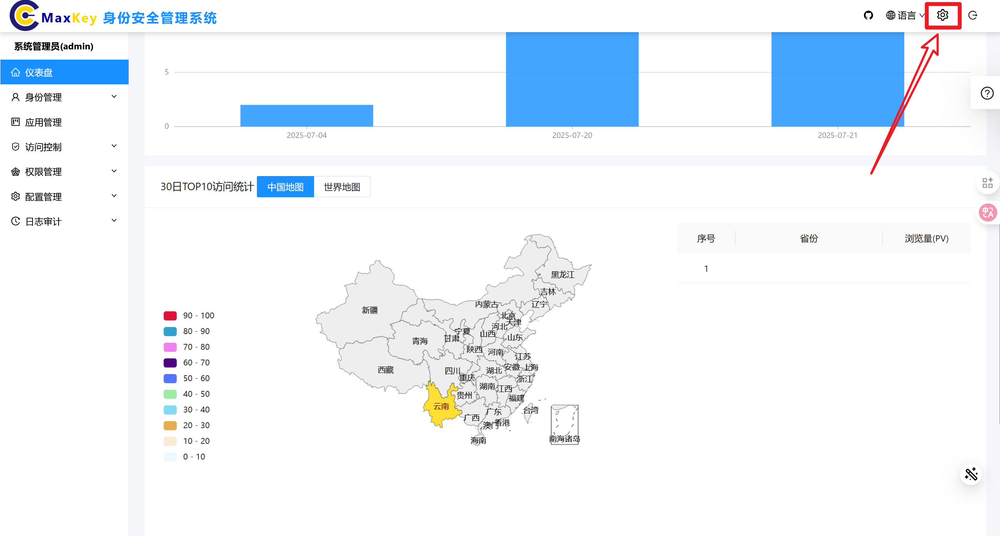
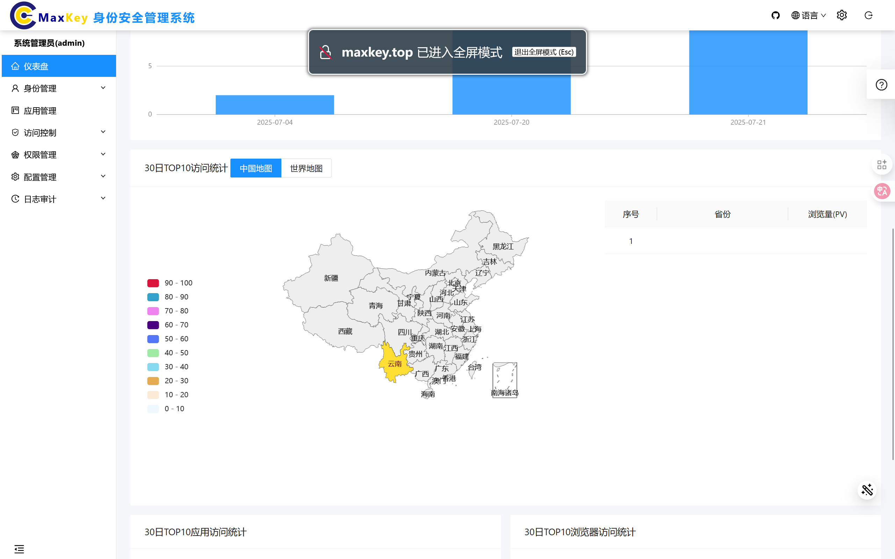
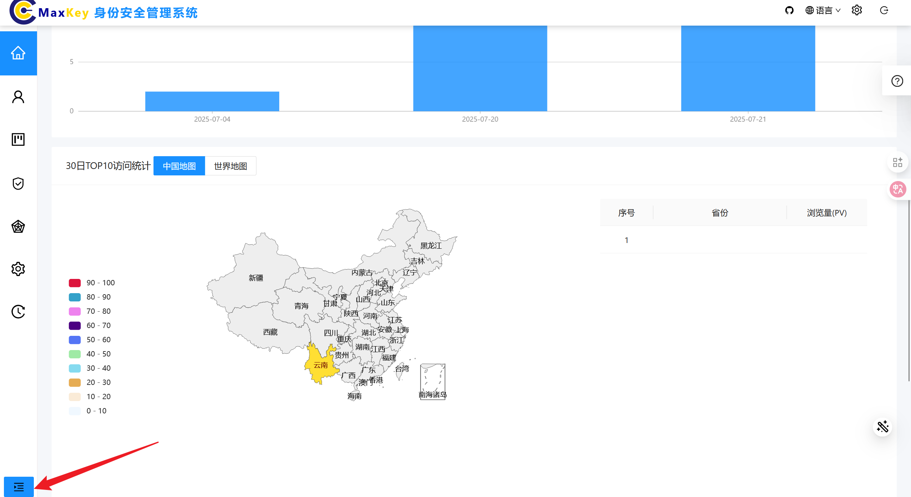

# 管理员仪表盘

## 概述
管理员仪表盘是系统管理的总控制台，提供系统运行状态的集中展示、关键数据统计分析和快速功能入口，帮助管理员全面掌握系统情况并高效完成日常管理工作。

## 访问路径
1. 使用管理员账户登录系统
2. 登录成功后自动进入仪表盘页面
3. 或在左侧导航栏中点击 **仪表盘** 图标进入

## 界面说明
仪表盘采用模块化布局，主要包含以下功能区域：
### 概览统计区
以卡片形式展示关键系统指标，主要包括：
- **当前在线用户**：当前同时在线的管理员和普通用户数量
- **今日访问量**：当天系统访问次数统计
- **当月新增用户数**：当前月新增用户数量
- **当月活跃用户数**：当前月活跃用户数量

### 数据图表区
通过可视化图表展示系统关键数据趋势，主要包括：
- **当日访问情况统计**：今日访问量统计
- **30日访问量统计**：30天访问量统计
- **30日应用访问排行**：30天应用系统的访问次数TOP10
- **30日访问地域分布**：用户访问的地理区域分布热力图
- **30日浏览器访问排行**：30天浏览器的访问次数TOP10

## 功能操作

### 页面设置
点击右上角的齿轮图标，可以选择使用RTL、全屏、清理本地缓存等功能

设置全屏：

点击左侧树图，最下面图标，可以切换数据图的显示方式：

