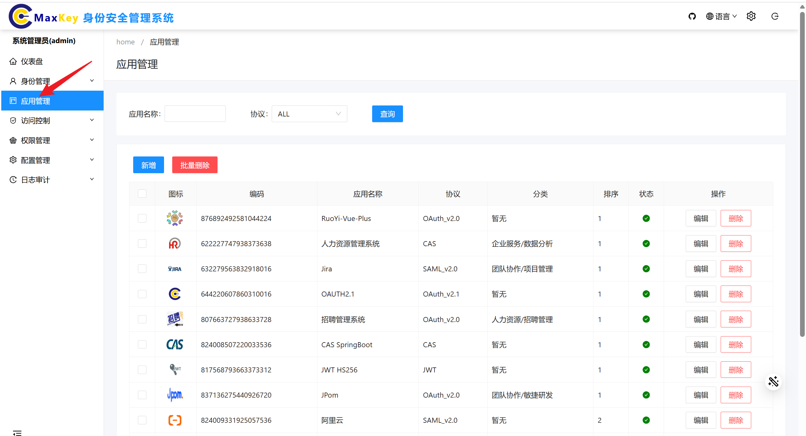
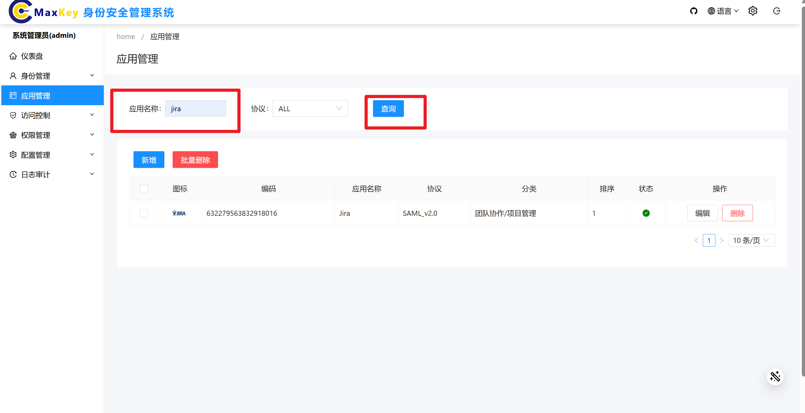
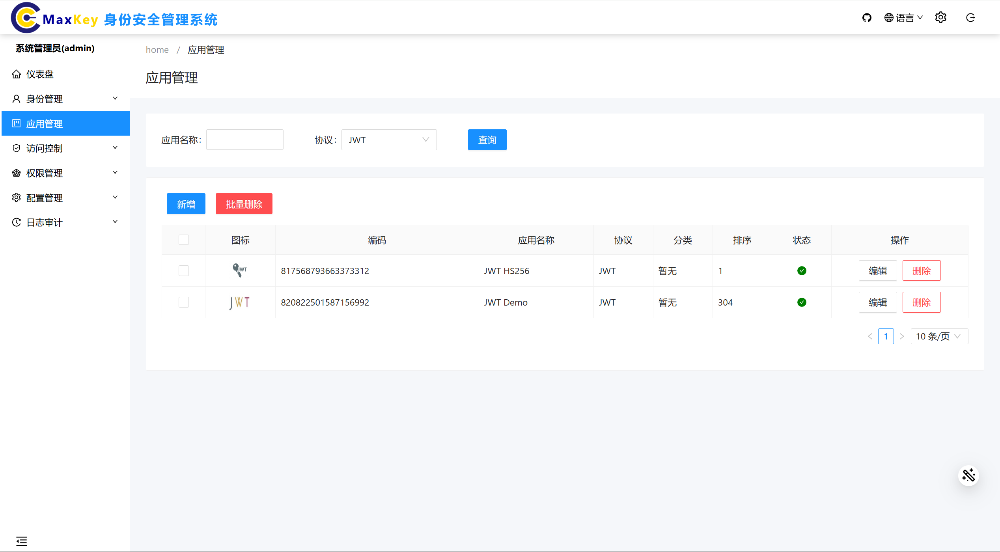
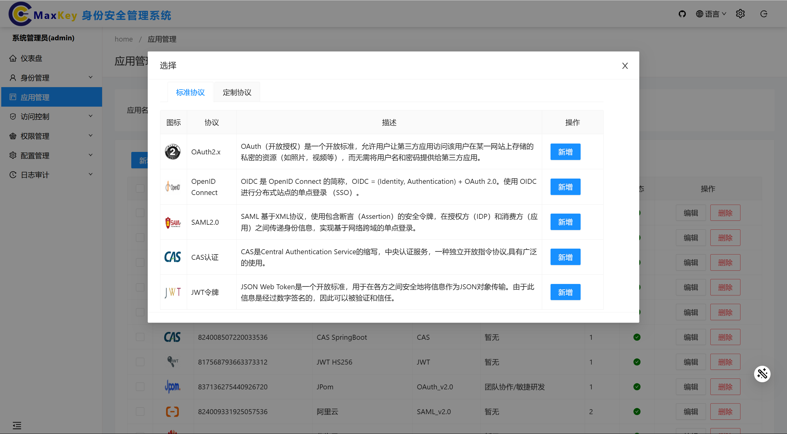
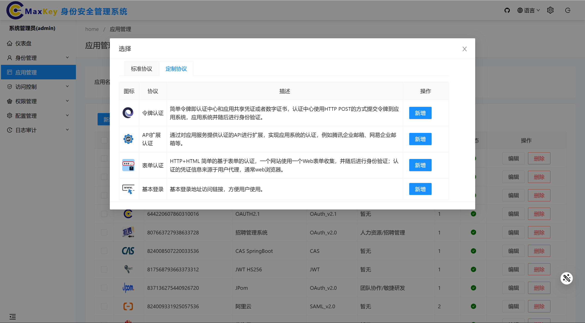
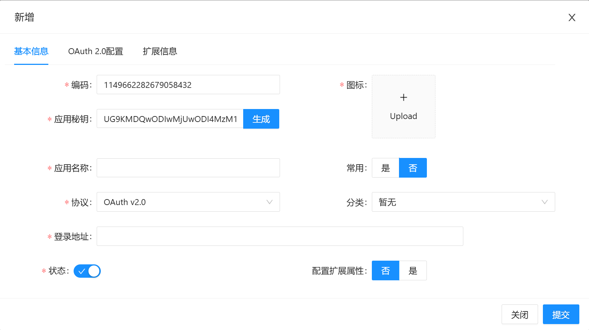
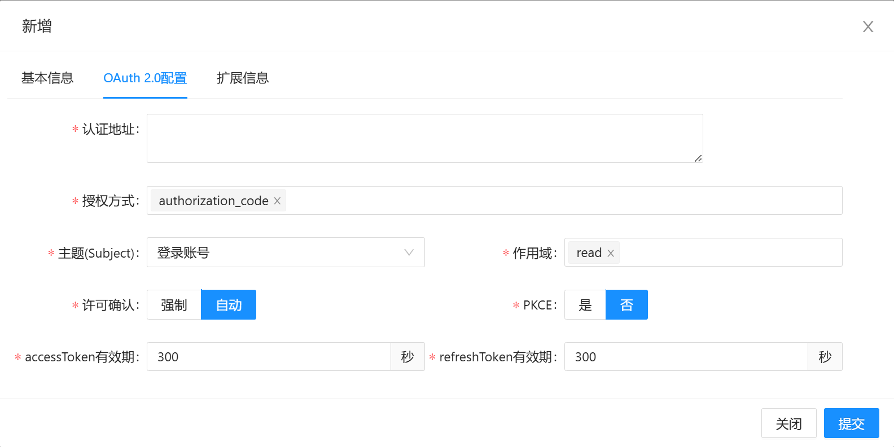
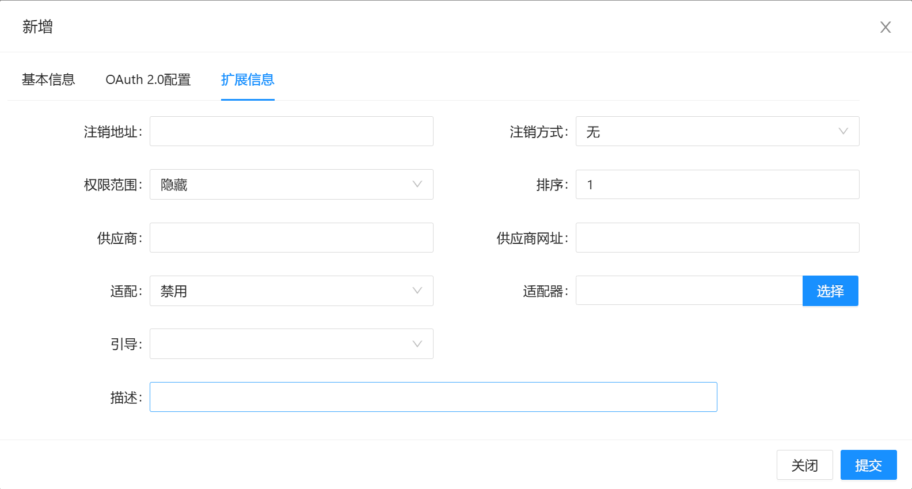
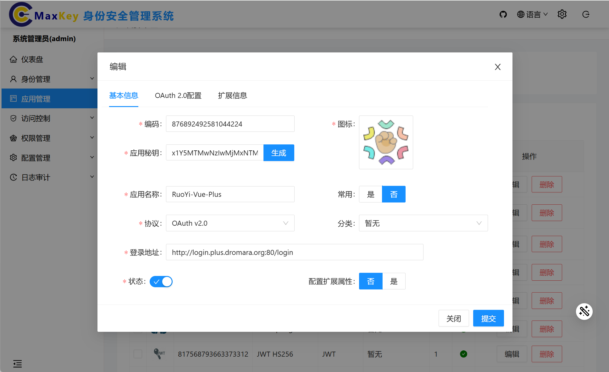

# 应用管理

## 概述
应用管理模块负责系统内所有集成应用的全生命周期管理，包括应用注册、配置、授权、监控和注销。通过统一的应用管理界面，管理员可以集中配置单点登录（SSO）参数、设置访问策略、分配用户权限，实现对企业各类应用的安全管控和便捷访问。

## 访问路径
1. 登录系统管理端
2. 在左侧导航栏中点击 **应用管理**

## 功能操作
### 应用协议认证管理
#### 查询应用协议认证
1. 进入应用管理主界面
2. 在查询区可选择以下查询方式：
   - **默认查询**：直接点击**查询**按钮，显示所有应用的协议认证信息
   - **条件查询**：
     - 在**应用名称**输入框中输入关键词
     - 在**协议类型**下拉框中选择特定协议（如OAuth2.0、SAML2.0等）
     - 点击**查询**按钮，显示匹配的应用协议认证信息
3. 查询结果将显示在应用列表中，包含应用名称、协议类型、状态等信息

根据名称查询

根据协议查询

#### 新增应用协议认证
1. 在应用列表页面点击 **新增** 按钮，弹出协议类型选择框
2. 分为两种类型：
  - **基于标准协议认证**：如OAuth2.x、SAML2.0、CAS、JWT令牌、OpenID Connect

  - **基于定制协议认证**：如令牌认证、API扩展认证、表单认证基本登录

3. 选择协议后，系统跳转到对应协议的配置界面
4. 根据界面提示填写协议认证要素信息（填写基本信息——配置信息——扩展信息）：
   - 以OAuth2.x为例（带*号的为必填项）：
      - 应用ID编码
      - 应用秘钥
      - 图标
      - 应用名称
      - 协议
      - 登录地址
      - 状态 

5. 填写完成后点击 **提交** 按钮
6. 系统提示"保存成功"后，新应用将出现在应用列表中

#### 编辑应用协议认证
1. 在应用列表中找到目标应用
2. 点击操作列的 **编辑** 按钮，进入应用协议认证编辑界面
3. 在编辑界面中可以修改以下信息：
   - 基本信息（应用名称、描述等）
   - 协议认证参数（根据所选协议类型不同而有所差异）
   - 访问控制策略
4. 修改完成后点击 **提交** 按钮
5. 系统提示"提交成功"后，修改内容将生效

#### 删除应用协议认证
1. 在应用列表中勾选一个或多个需要删除的应用
2. 点击页面上方的 **删除** 按钮
3. 系统提示"删除成功"，所选应用将从列表中移除
> **注意**：删除应用协议认证信息前，请确保该应用已不再使用，删除后将无法恢复

