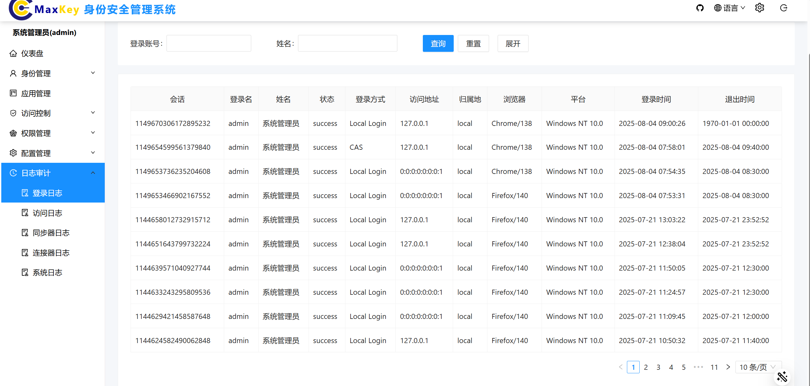
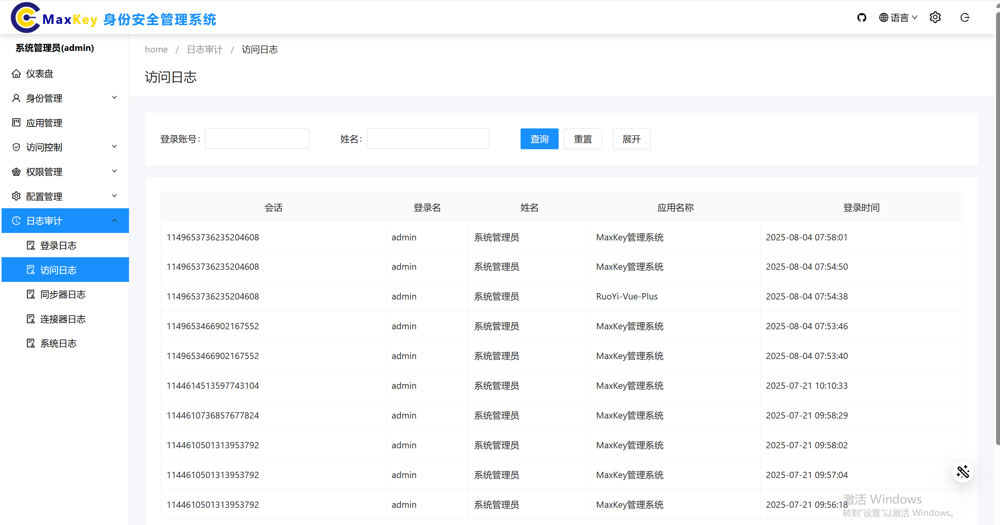
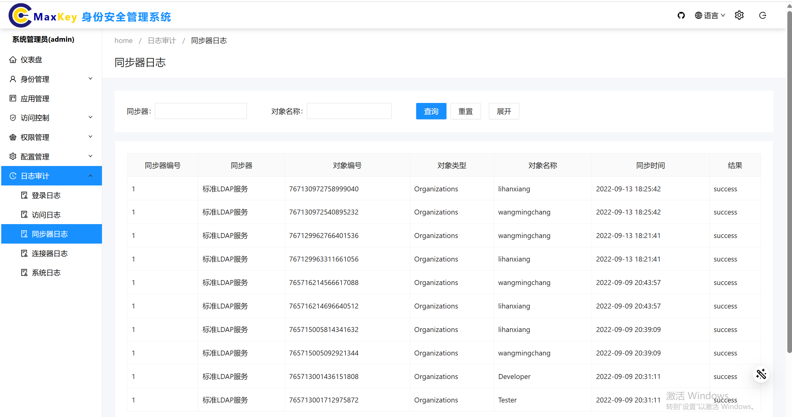
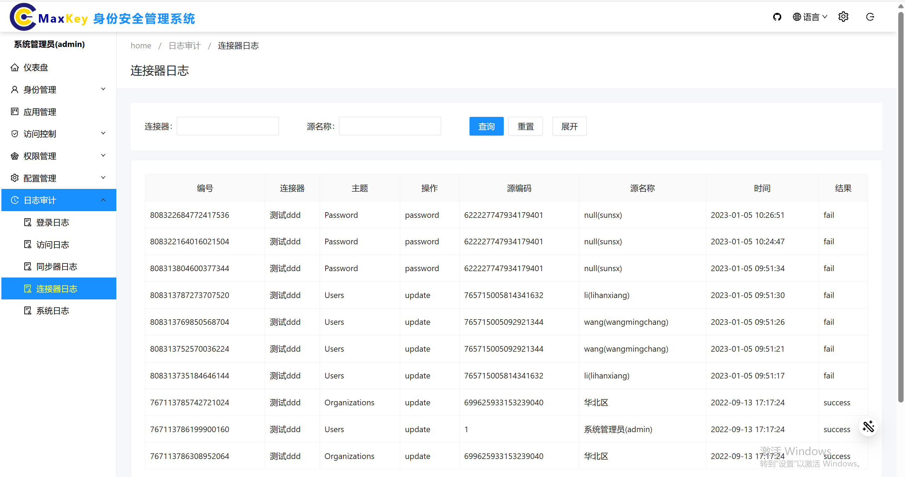
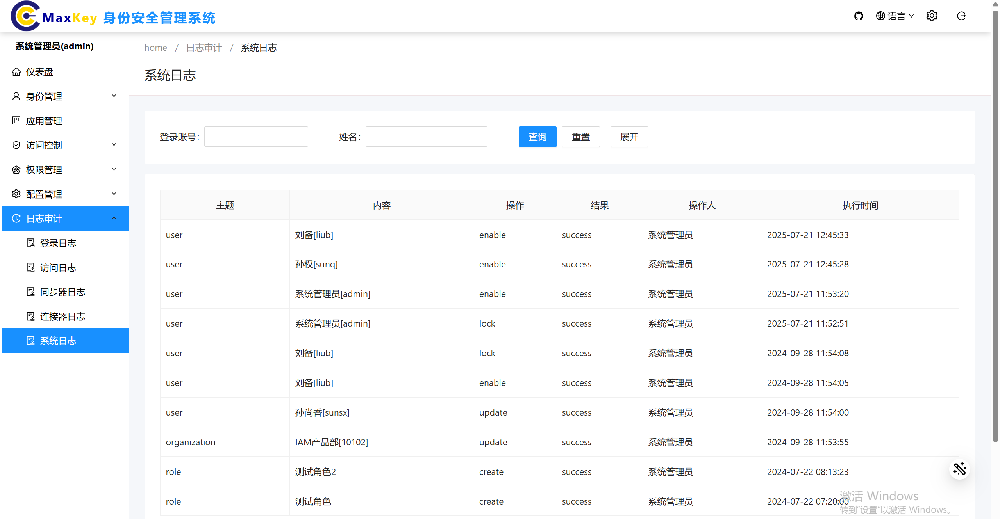

# 日志审计

## 概述
日志审计模块是系统安全审计的核心组件，负责采集、存储、分析和展示系统内所有操作行为和安全事件日志。通过集中化的日志管理，管理员可以追溯用户操作、排查安全事件、满足合规要求（如等保2.0），并通过日志分析发现潜在的安全风险。

## 访问路径
1. 登录系统管理端
2. 在左侧导航栏中选择 **日志审计** 菜单，展开后显示五个二级子节点：
   - 登录日志
   - 访问日志
   - 同步器日志
   - 连接器日志
   - 系统日志

## 核心日志类型与字段
| 日志类型       | 核心字段                                                                 |
|----------------|--------------------------------------------------------------------------|
| 系统登录日志   | 会话、登录名、姓名、状态、登录方式、访问地址、浏览器、平台、登录时间、退出时间 |
| 应用访问日志   | 会话、登录名、姓名、应用名称、登录时间                                   |
| 同步器日志     | 同步器编号、同步器、对象编号、对象类型、对象名称、同步时间、结果         |
| 连接器日志     | 编号、连接器、类型、源编码、源名称、对象编号、对象名称、时间、结果       |
| 系统管理日志   | 主题、内容、操作、结果、操作人、执行时间                                 |

## 功能操作

### 登录日志
选中左侧导航栏中的 **登录日志** 二级菜单节点，进入系统登录日志界面。

#### 界面说明
在登录日志界面，可以查看用户系统登录的详细信息，列表展示包括：会话、登录名、姓名、状态、登录方式、访问地址、浏览器、平台、登录时间、退出时间等信息。

#### 查询操作
1. 基础查询条件包括：登录账号、姓名
2. 点击 **展开** 按钮，会显示更多查询条件：员工编号、开始时间、结束时间
3. 可以组合以上条件进行精确查询
4. 点击 **查询** 按钮获取匹配结果

### 访问日志
选中左侧导航栏中的 **访问日志** 二级菜单节点，进入应用访问日志界面。

#### 界面说明
在应用访问日志界面，可以查看用户访问应用的详细信息，列表展示包括：会话、登录名、姓名、应用名称、登录时间等信息。

#### 查询操作
1. 基础查询条件包括：登录账号、姓名
2. 点击 **展开** 按钮，会显示更多查询条件：员工编号、开始时间、结束时间
3. 可以组合以上条件进行精确查询
4. 点击 **查询** 按钮获取匹配结果

### 同步器日志
选中左侧导航栏中的 **同步器日志** 二级菜单节点，进入同步器日志界面。

#### 界面说明
在同步器日志界面，可以查看应用同步的详细信息，列表展示包括：同步器编号、同步器、对象编号、对象类型、对象名称、同步时间、结果等信息。

#### 查询操作
1. 基础查询条件包括：登录账号、姓名
2. 点击 **展开** 按钮，会显示更多查询条件：员工编号、开始时间、结束时间
3. 可以组合以上条件进行精确查询
4. 点击 **查询** 按钮获取匹配结果

### 连接器日志
选中左侧导航栏中的 **连接器日志** 二级菜单节点，进入连接器日志界面。

#### 界面说明
在连接器日志界面，可以查看连接器的详细信息，列表展示包括：编号、连接器、类型、源编码、源名称、对象编号、对象名称、时间、结果等信息。

#### 查询操作
1. 基础查询条件包括：登录账号、姓名
2. 点击 **展开** 按钮，会显示更多查询条件：员工编号、开始时间、结束时间
3. 可以组合以上条件进行精确查询
4. 点击 **查询** 按钮获取匹配结果

### 系统日志
选中左侧导航栏中的 **系统日志** 二级菜单节点，进入系统管理日志界面。

#### 界面说明
在系统管理日志界面，可以查看用户的所有系统管理操作信息，列表展示包括：主题、内容、操作、结果、操作人、执行时间等信息。

#### 查询操作
1. 基础查询条件包括：登录账号、姓名
2. 点击 **展开** 按钮，会显示更多查询条件：员工编号、开始时间、结束时间
3. 可以组合以上条件进行精确查询
4. 点击 **查询** 按钮获取匹配结果

