# 权限管理

## 概述
权限管理模块用于配置和管理系统中的各种权限策略，包括角色定义、权限分配、资源控制等功能，帮助管理员实现精细化的访问控制。

## 访问路径
1. 登录系统管理端
2. 在左侧导航栏中选择 **权限管理** 菜单：
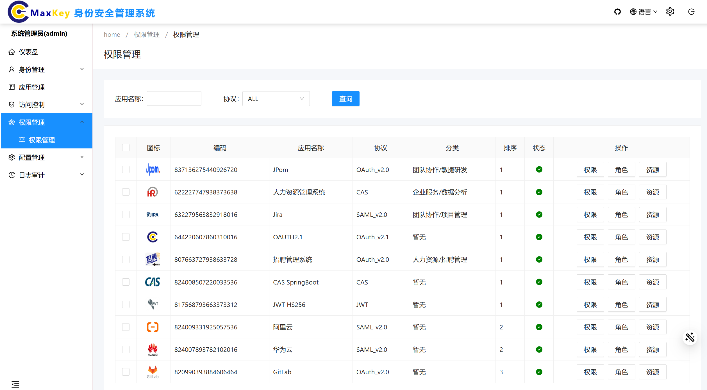

## 权限管理操作

### 资源管理
选中需要进行进行权限管理的系统 右侧对应的 **资源** 菜单节点，进入资源管理界面。

#### 资源操作
在资源管理界面，可以对资源做以下操作：

##### 查询资源
1. 在搜索框中输入资源名称
2. 点击 **查询** 按钮获取匹配结果
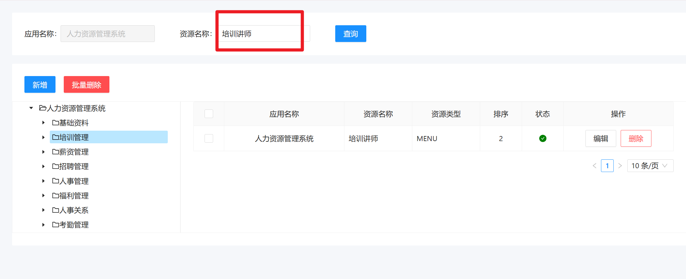

##### 新增资源
1. 点击 **新增** 按钮，弹出资源信息填写界面
2. 根据界面提示填写资源信息要素：
   - 资源名称（必填）
   - 资源类型（必填）
   - 父级编码（必填）
3. 填写完成后点击 **保存** 按钮
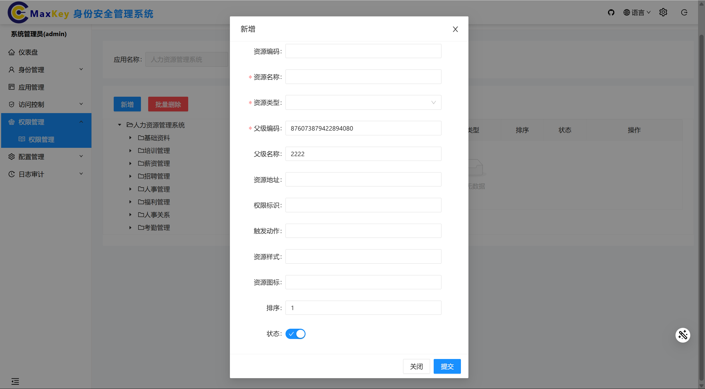
##### 编辑资源
1. 在资源列表中找到目标资源，点击 **编辑** 按钮
2. 修改相关信息
3. 点击 **保存** 完成修改
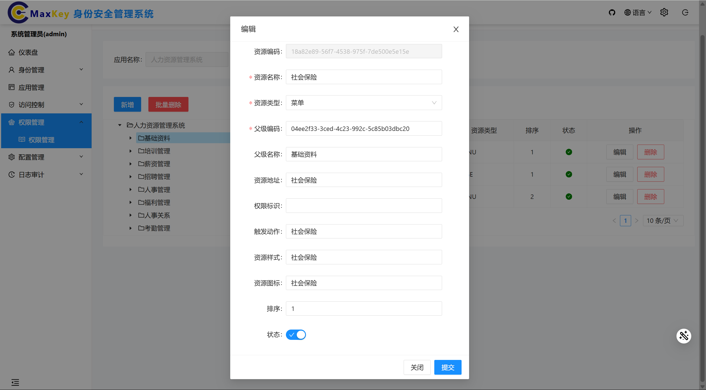

##### 删除资源
1. 在资源列表中找到目标资源，点击 **删除** 按钮
2. 在确认对话框中点击 **确认** 完成删除
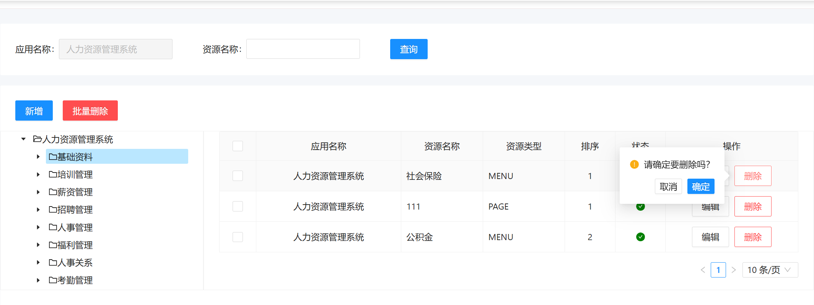

### 角色管理
### 角色管理
选中对应应用右侧中的 **角色** 菜单节点，进入角色管理界面。
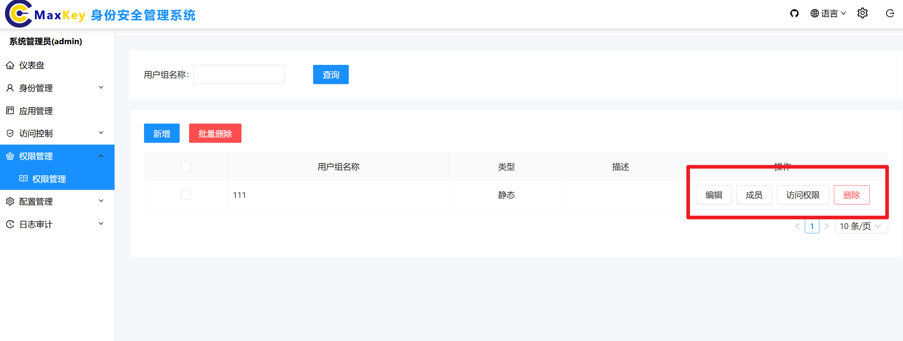

#### 角色成员管理
1. 点击**成员**查询后，界面会显示该角色下的成员信息列表
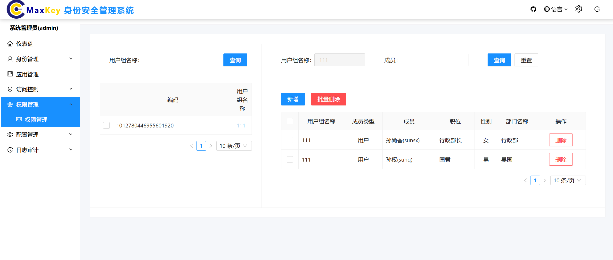
2. 可以查看成员的基本信息和当前权限配置

#### 新增角色
1. 点击 **新增角色** 按钮
2. 填写角色信息
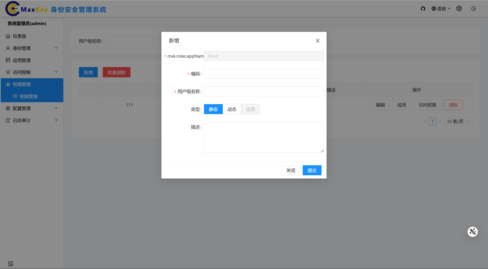
3. 点击 **保存** 完成创建

#### 编辑角色
1. 在角色列表中找到目标角色，点击 **编辑** 按钮
2. 修改相关信息
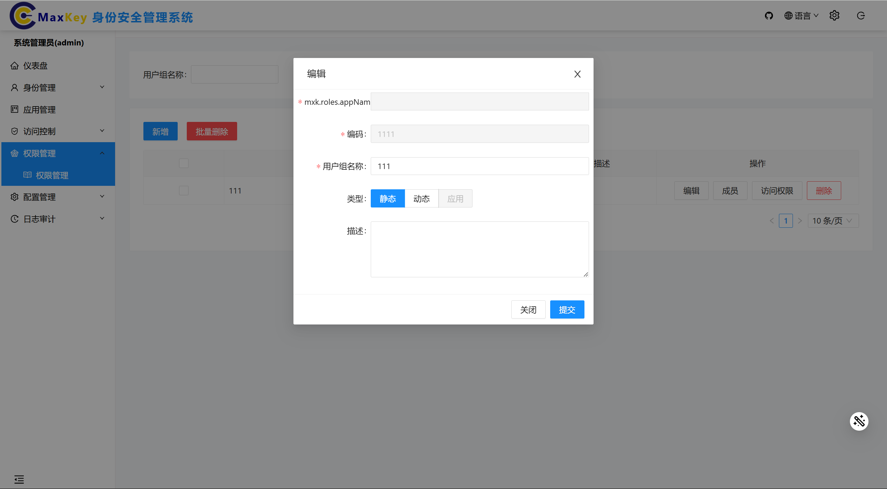
3. 点击 **保存** 完成修改

#### 删除角色
1. 在角色列表中找到目标角色，点击 **删除** 按钮
2. 在确认对话框中点击 **确认**
> **注意**：系统内置角色不允许删除
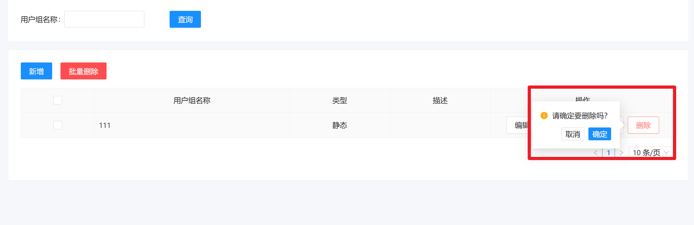

### 权限分配
选中需要进行进行权限管理的系统 右侧对应的 **权限** 菜单节点，进入权限管理界面。
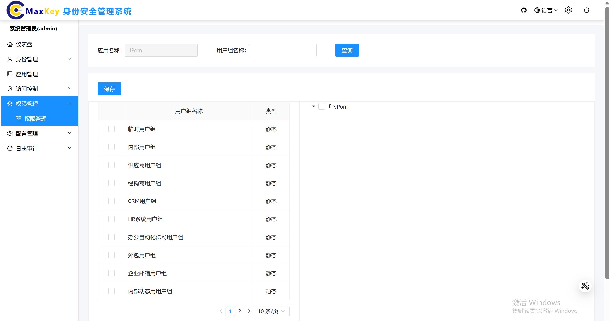

