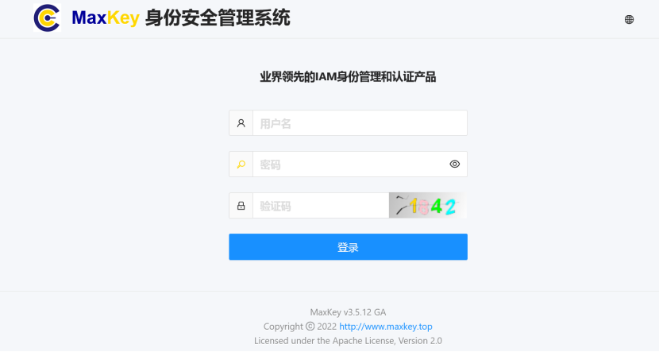
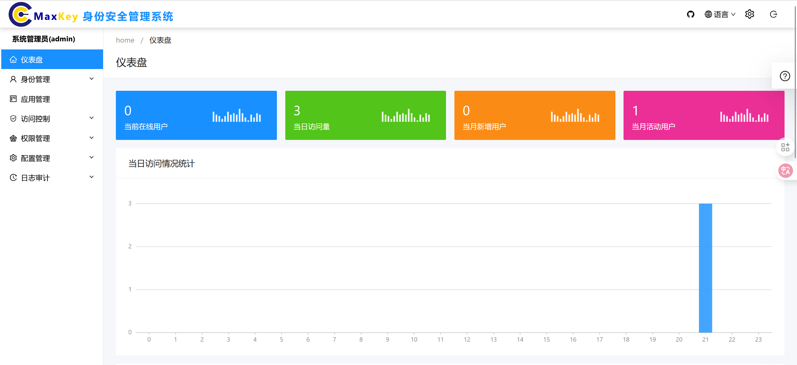
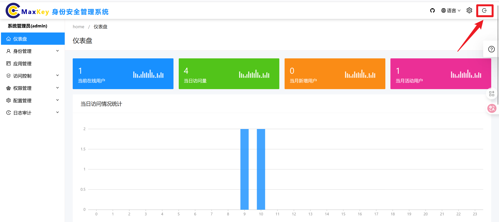

# 登录

## 概述
管理员登录模块是系统安全访问的第一道防线，用于验证管理员身份并授予相应的系统管理权限。本文档详细介绍管理员登录系统的各种方式、操作步骤、安全策略及常见问题处理方法。

## 访问路径
### 常规访问
1. 打开浏览器，输入系统管理端URL：`http://mgt.maxkey.top/maxkey-mgt/`
2. 系统显示管理员登录界面

### 备用访问
当主登录页面无法访问时，可通过以下路径登录：
1. 访问用户端首页：`	http://sso.maxkey.top/maxkey/`
2. 点击页面顶部的 **后台** 链接
3. 跳转至管理员登录界面

## 登录界面说明
管理员登录界面包含以下关键元素：
- **系统标识区**：显示系统名称及Logo
- **登录表单区**：根据选择的登录方式显示相应的输入表单 （仅支持用户名密码登录方式）
- **安全提示区**：显示当前登录环境安全状态及提示信息
- **辅助功能区**：包含忘记密码、语言切换、帮助链接等功能
- **版权信息区**：显示系统版本及版权声明

## 登录方式及操作步骤

### 1. 用户名密码登录
这是系统默认的基础登录方式，适用于所有管理员账户。

#### 操作步骤：
1. 在登录方式切换区选择 **用户名密码登录**
2. 在登录表单中输入以下信息：
   - **管理员账号**：输入管理员用户名或邮箱
   - **密码**：输入账户密码（区分大小写）
   - **验证码**：输入页面显示的图形验证码
3. 点击 **登录** 按钮
4. 验证通过后，系统自动跳转至管理员控制台首页

### 退出登录
退出登录时，请务必点击 **退出** 图标，以安全退出系统。

## 登录异常处理

### 登录页面无法访问
1. 检查网络连接是否正常
2. 确认服务器是否正常运行
3. 检查访问端口是否正确
4. 清除浏览器缓存后重试
5. 尝试使用其他浏览器或设备
6. 联系系统运维人员检查服务状态

## 常见问题解答

### Q1: 为什么输入正确的用户名密码却无法登录？
A1: 可能原因及解决方法：
1. 账户已被锁定：等待解锁或联系其他管理员解锁
2. IP地址受限：使用允许的IP地址登录或联系管理员添加IP白名单
3. 密码已过期：联系管理员重置密码
4. 浏览器缓存问题：清除浏览器缓存或使用隐私模式尝试
5. 账户已被禁用：联系超级管理员检查账户状态

### Q2: 登录后系统提示"权限不足"是什么原因？
A3: 可能原因：
1. 账户权限已被修改或撤销
2. 当前登录角色不具备管理端访问权限
3. 会话已过期，需重新登录
4. 账户处于待激活状态
解决方法：联系超级管理员检查并调整账户权限

### Q4: 如何查看管理员登录日志？
A4: 系统记录所有管理员登录活动，可通过以下路径查看：
1. 使用超级管理员账户登录
2. 进入 **审计** -> **系统登录日志**
3. 可查看登录时间、IP地址、设备信息、登录状态等详细记录

### Q5: 单点登录失败如何处理？
A5: 单点登录失败的排查步骤：
1. 确认企业单点登录系统是否正常运行
2. 检查浏览器是否阻止了重定向
3. 清除浏览器Cookie后重试
4. 联系系统管理员检查单点登录配置
5. 作为临时解决方案，可使用用户名密码方式登录