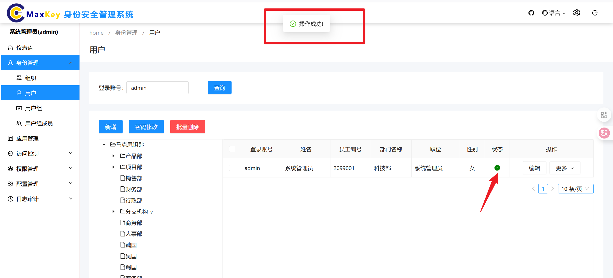

# 用户管理

## 概述
用户管理模块用于维护系统用户信息，支持用户的全生命周期管理，包括查询、新增、编辑、删除及密码重置等功能，实现对系统用户的集中管控。

## 访问路径
1. 登录系统管理端
2. 在左侧导航栏中，依次展开 **身份管理** -> **用户**
3. 点击 **用户** 节点进入主界面

## 界面说明
### 主要功能区
- **组织机构树**：左侧树形结构，展示系统中的组织架构
- **查询区**：包含用户登录账号输入框和**查询**按钮
- **用户列表**：中部表格区域，显示符合条件的用户信息 
- **操作按钮**：列表上方包含**新增**、**密码修改**等功能按钮
- **编辑下拉菜单**：每条用户记录操作列的**编辑**按钮包含更多操作选项

## 功能操作
### 查询用户
#### 方式一：通过组织机构查询
1. 在左侧**组织机构树**中点击目标组织节点
2. 右侧用户列表将自动刷新为该组织下的所有用户

#### 方式二：通过账号查询
1. 在查询框中输入**用户登录账号**
2. 点击**查询**按钮
3. 用户列表将显示匹配的用户记录

### 新增用户
1. 点击页面上方**新增**按钮，打开用户信息编辑弹窗
2. 在各标签页中填写用户信息：
   - **基本信息**（必填）：
     - 登录账号（字母/数字组合，唯一标识）
     - 用户名（显示名称）
     - 密码（需符合密码策略要求）
     - 确认密码
   - **所属机构**：选择用户所属的组织机构
   - **个人信息**：姓名、性别、出生日期等
   - **机构扩展**：职位、工号等组织相关信息
   - **家庭信息**（选填）：联系电话、家庭住址等
3. 填写完成后点击**保存**按钮
4. 系统自动校验必填项，全部通过后提示"保存成功"
5. 新用户将出现在用户列表中

### 密码修改
1. 在用户列表中勾选目标用户
2. 点击页面上方**密码修改**按钮，打开密码修改弹窗
3. 设置新密码（两种方式可选）：
   - **手动输入**：在密码框中自行输入符合规则的密码
   - **自动生成**：点击**生成**按钮，系统自动创建随机密码
     - 点击**查看**按钮可显示生成的密码明文
4. 确认密码无误后点击**提交**按钮
5. 系统提示"密码修改成功"

### 编辑用户
#### 基本信息编辑
1. 在用户列表中找到目标用户
2. 点击操作列的**编辑**按钮，打开用户信息编辑弹窗
3. 修改相应信息（与新增用户字段相同）
4. 点击**保存**按钮完成修改

#### 高级操作（通过编辑下拉菜单）
1. 点击用户记录操作列**更多**按钮的下拉箭头
2. 从菜单中选择需要的操作：
   - **用户组**：配置用户所属的用户组
   - **密码修改**：同独立密码修改功能
   - **启用**：激活禁用状态的用户
   - **锁定**：临时锁定用户账号
   - **禁用**：停用用户账号
   - **删除**：移除用户记录

### 删除用户
1. 在用户列表中勾选一个或多个用户
2. 点击操作列**编辑**按钮下拉菜单中的**删除**选项
3. 在确认对话框中点击**确定**
4. 系统提示"删除成功"，用户记录从列表中移除

### 用户状态管理
1. 已删除用户恢复：
   - 通过查询找到已删除用户（需调整查询条件包含已删除状态）
   - 点击**编辑**按钮打开用户信息弹窗
   - 在**基本信息**标签页中找到**状态**下拉框
   - 选择**正常**或**启用**状态
   - 点击**保存**按钮完成状态恢复

2. 状态说明：
   - **正常**：可正常登录和使用系统
   - **锁定**：临时限制登录（通常因密码错误次数过多）
   - **禁用**：管理员手动停用账号
   - **删除**：标记为删除状态（可恢复）

## 注意事项
1. **必填项校验**：
   - 新增/编辑用户时，带`*`标识的字段为必填项
   - 提交前系统会自动校验，未完善项会标红提示

2. **密码策略**：
   - 密码长度至少8位
   - 需包含大小写字母、数字和特殊符号
   - 自动生成的密码默认符合复杂度要求

3. **用户关联**：
   - 删除用户前请确保其已与所有角色、岗位解除关联
   - 禁用用户不会删除其历史数据和关联关系

## 常见问题
**Q：如何批量修改用户密码？**
A：目前系统不支持批量密码修改，需逐个用户操作。

**Q：用户被锁定后如何处理？**
A：管理员可通过**更多**下拉菜单中的**启用**操作解除锁定。
