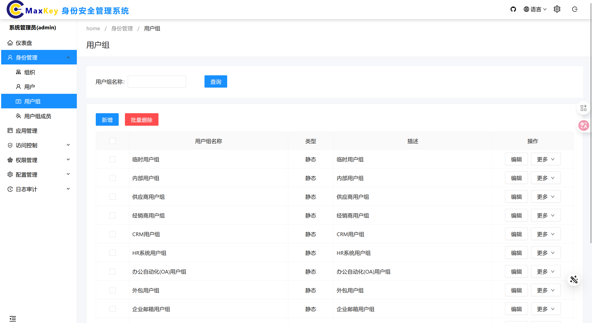
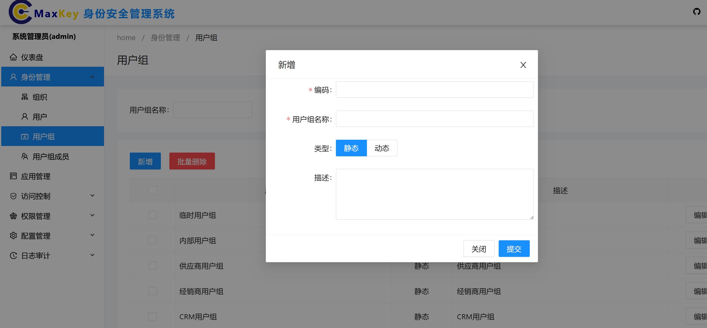
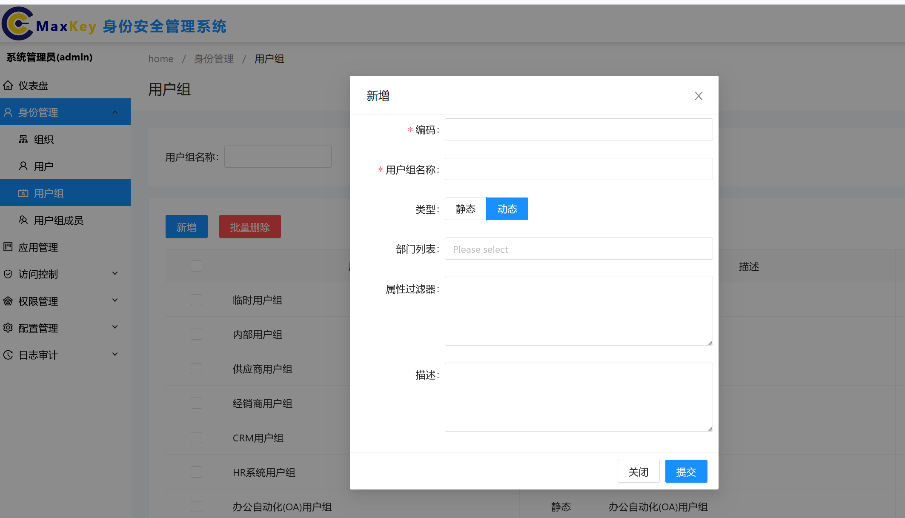
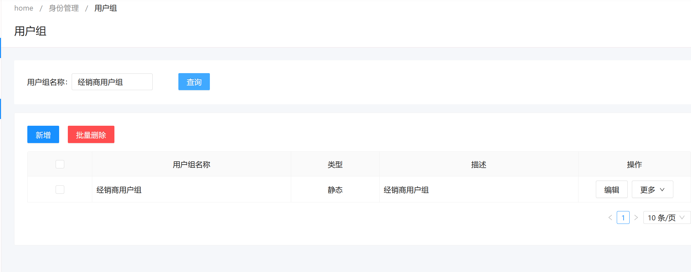
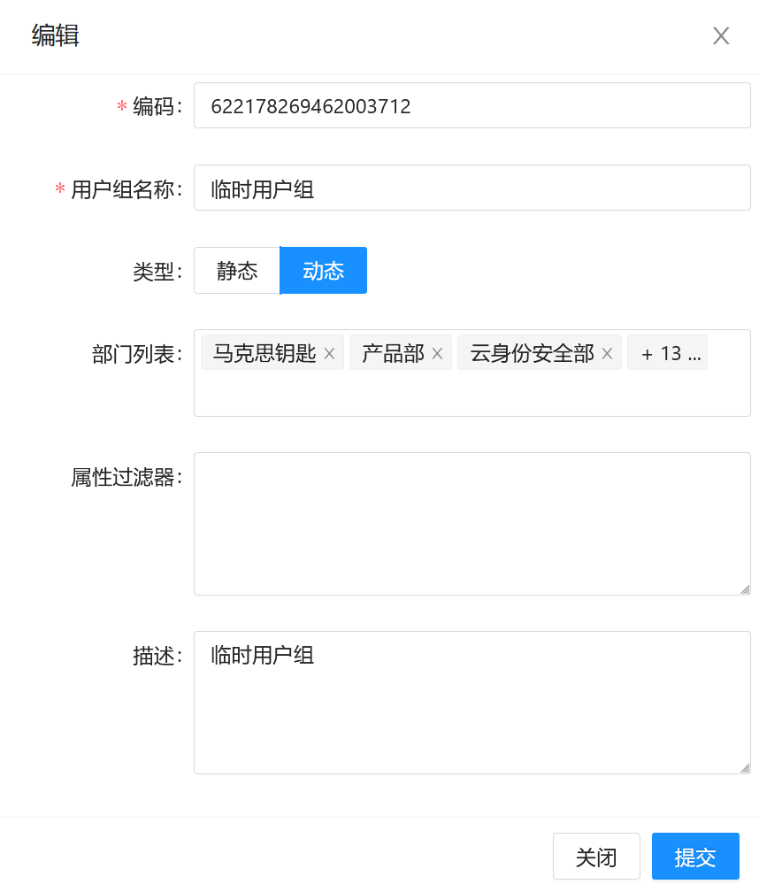
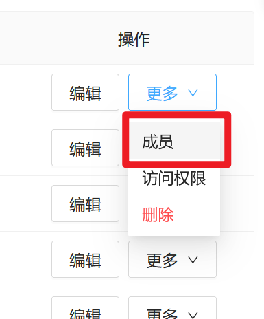
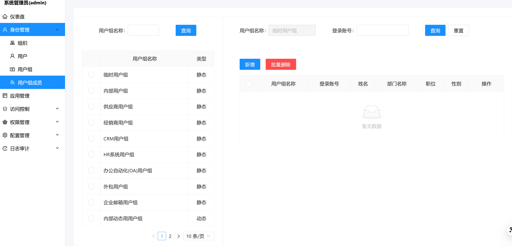
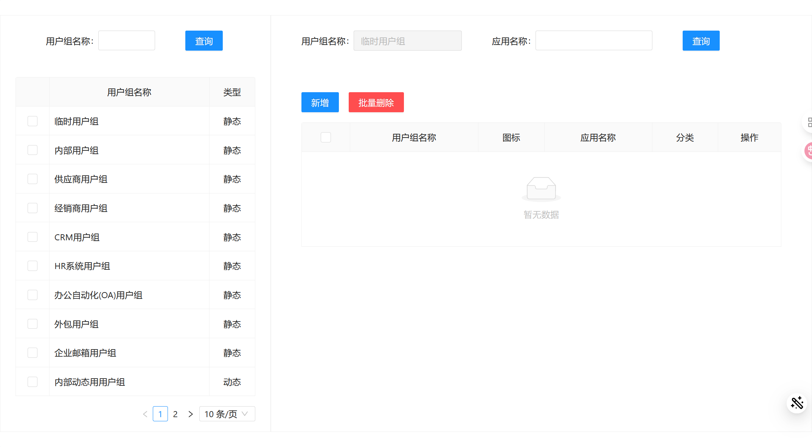

# 用户组管理

## 概述

在身份管理模块中，用户组用于对用户进行分类和管理。通过用户组，可以方便地对不同类型的用户进行权限分配和管理。

## 用户组列表
用户组列表页面用于查看、创建、编辑和删除用户组。

### 操作说明

- **新增**：点击“新增”按钮，可以创建新的用户组。

 1. 可以新增静态板用户组：

 2. 可以新增动态用户组：

- **批量删除**：选择多个用户组后，点击“批量删除”按钮，可以一次性删除选中的用户组。
- **查询**：在“用户组名称”输入框中输入关键词，点击“查询”按钮，可以快速查找特定的用户组。

- **编辑**：点击用户组对应的“编辑”按钮，可以修改该用户组的信息。
- **更多**：点击用户组对应的“更多”按钮，可以展开更多操作选项，如查看该用户组的用户列表、查看该用户组所关联的权限、删除该用户组等。

## 使用步骤

1. **进入用户组页面**：
   - 在导航栏中依次点击“home / 身份管理 / 用户组”，进入用户组管理页面。

2. **查询用户组**：
   - 在“用户组名称”输入框中输入关键词，点击“查询”按钮，可以快速查找特定的用户组。

3. **新增用户组**：
   - 点击页面上方的“新增”按钮，打开新增用户组的对话框。
   - 填写用户组名称、类型和描述等信息，点击“保存”按钮完成新增。

4. **编辑用户组**：
   - 在用户组列表中找到需要编辑的用户组，点击对应的“编辑”按钮。
   - 修改用户组的相关信息，点击“保存”按钮完成编辑。

5. **批量删除用户组**：
   - 在用户组列表中选择需要删除的用户组，点击页面上方的“批量删除”按钮。
   - 系统会弹出确认对话框，确认无误后点击“确定”按钮完成删除。

6. **其他操作**：
   - 在用户组列表中找到需要操作的用户组，点击对应的“更多”按钮，选择相应的操作项进行操作。

7. **用户组权限管理**：
  - 在用户组列表中找到需要操作的用户组，点击“更多”按钮下拉菜单中的“权限”，进入权限管理页面。
  - 在权限管理页面中，可对用户组进行权限配置。

通过以上步骤，您可以方便地管理和维护用户组，确保系统的安全性和高效性。