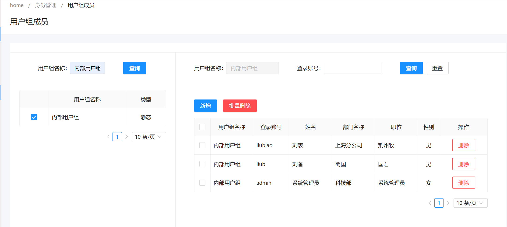
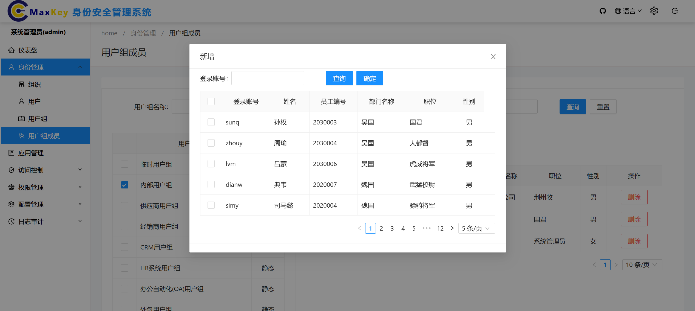
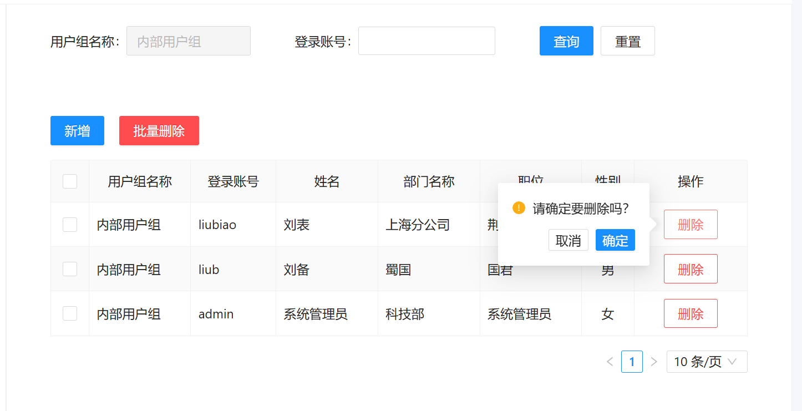
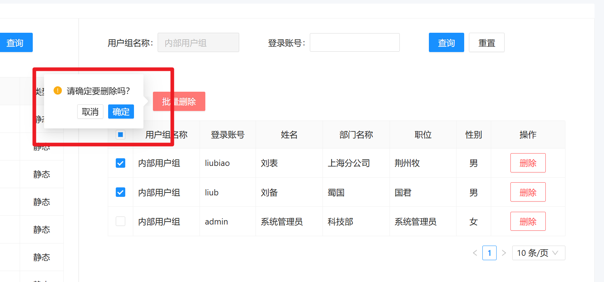

# 查询用户组成员
1. 在**身份管理**目录下的**用户组成员**页面左上方的**用户组名称**对应的输入框中输入要查询的用户组名称，点击查询键，即可检索到对应的用户组全部成员

# 添加用户组成员
在**身份管理**目录下的**用户组成员**页面左上上方的**添加**按钮，点击添加按钮，进入添加用户组成员页面

# 删除用户组成员
## 单个用户删除
在**身份管理**目录下的**用户组成员**页面中，找到要删除的用户，点击**删除**按钮，选择**确定**，即可删除该用户

## 批量用户删除
在**身份管理**目录下的**用户组成员**页面中，选中要删除的用户，点击**批量删除**按钮，选择**确定**，即可删除选中的用户

