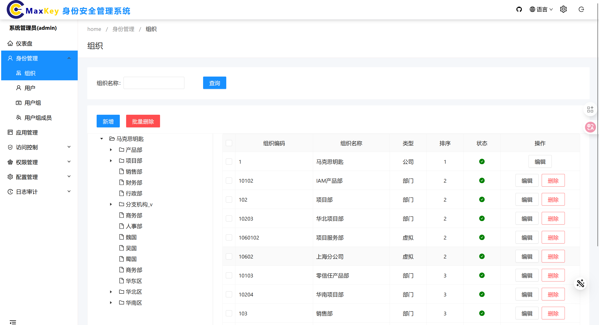
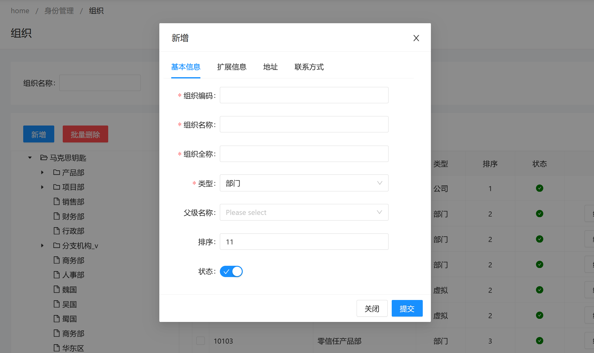
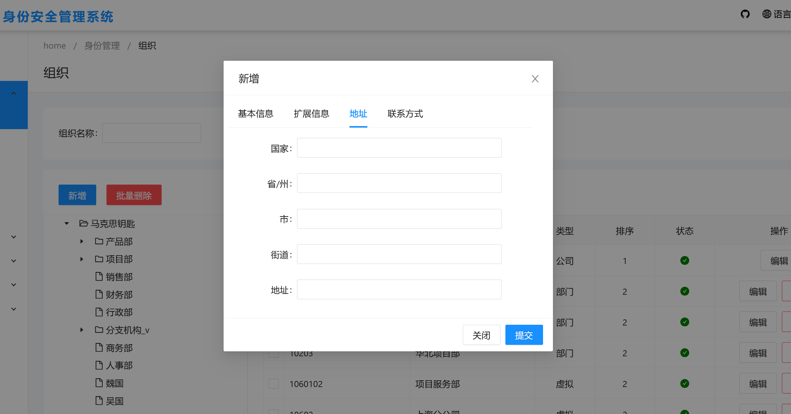
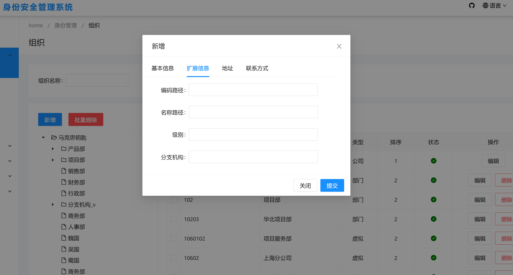
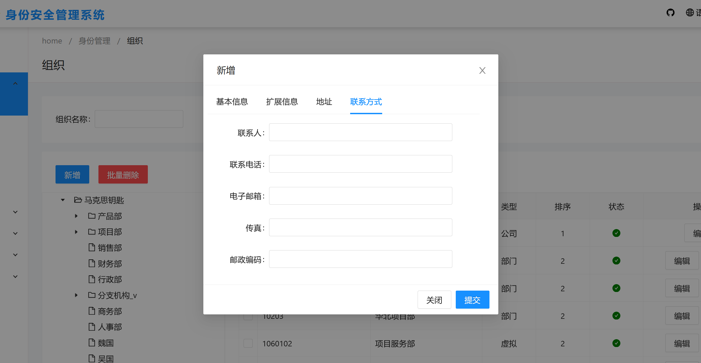
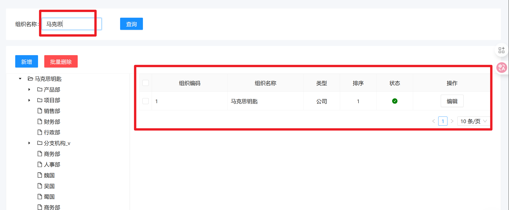
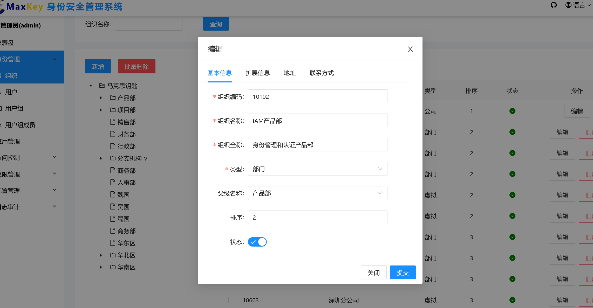
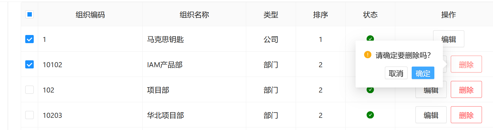

# 组织

## 概述
组织管理模块用于维护企业组织结构信息，支持对组织的查询、新增、编辑和删除操作，帮助管理员构建清晰的组织架构体系。

## 访问路径
1. 登录系统管理端
2. 在左侧导航栏中，依次展开 **身份管理** -> **组织**
3. 点击 **组织** 节点进入主界面

## 界面说明
### 主要功能区
- **查询区**：位于页面顶部，包含组织名称输入框和**查询**按钮
- **组织树图**：左侧树形结构，展示完整的组织架构层级关系
- **组织列表**：右侧表格区域，显示当前选中组织下的所有子组织信息
- **操作按钮**：列表上方包含**新增**、**批量删除**功能按钮

### 新增/编辑组织弹窗
弹窗包含四个标签页：
- **基本信息**：组织名称、编码、负责人、排序号等核心信息
- **扩展信息**：自定义字段和补充说明信息
- **地址**：详细联系地址信息
- **联系方式**：电话、邮箱等联系信息

## 功能操作
### 查询组织
#### 方式一：关键词查询
1. 在查询区输入框中填写**组织名称**
2. 点击**查询**按钮
3. 组织列表将显示匹配的组织信息

#### 方式二：组织树查询
1. 在左侧组织树图中点击展开层级结构
2. 直接点击目标组织节点
3. 右侧列表将显示该组织及其下属子组织信息

### 新增组织
1. 点击页面上方**新增**按钮，打开新增组织弹窗
2. 在各标签页中填写组织信息：
   - **基本信息**（必填）：
     - 组织名称（不超过50字符）
     - 组织编码（字母或数字，不超过20字符）
     - 负责人（从用户列表选择）
     - 排序号（数字，用于组织排序）
   - **扩展信息**（选填）：根据实际需求填写自定义字段
   - **地址**（选填）：省/市/区、详细地址、邮政编码
   - **联系方式**（选填）：固定电话、移动电话、邮箱地址
3. 填写完成后点击**保存**按钮
4. 系统提示"保存成功"后自动关闭弹窗
5. 可通过查询功能验证新组织是否创建成功

### 编辑组织
1. 在组织列表中勾选需要修改的组织
2. 点击页面上方**编辑**按钮，打开编辑组织弹窗
3. 在各标签页中修改相应信息：
   - **基本信息**标签页中可修改组织状态：
     - 勾选"启用"复选框：激活组织（默认状态）
     - 取消勾选"启用"复选框：停用组织
4. 修改完成后点击**提交**按钮
5. 系统提示"提交成功"后自动关闭弹窗
6. 可通过查询功能验证修改结果

### 删除组织
1. 在组织列表中勾选需要删除的组织（可多选）
2. 点击页面上方**删除**按钮
3. 在确认对话框中点击**确定**
4. 系统提示"删除成功"，列表中将移除所选组织记录

## 注意事项
1. **必填字段规则**：
   - 组织名称和编码为必填项
   - 组织编码不可重复
   - 负责人必须是系统中已存在的用户

2. **状态管理**：
   - 停用的组织仍会显示在列表中，但无法进行业务操作
   - 包含子组织的父组织不允许删除

3. **数据验证**：
   - 提交时系统会自动验证数据格式
   - 不符合规则的字段会标红提示并阻止提交

## 常见问题
**Q：为什么无法删除某个组织？**
A：可能原因有：
1. 该组织下仍包含子组织，请先删除所有子组织
2. 该组织已关联用户或应用权限，请先解除关联关系
3. 当前登录用户没有组织删除权限

**Q：组织编码可以修改吗？**
A：不可以，组织编码在创建后不可修改，如需变更请创建新组织并迁移相关数据。