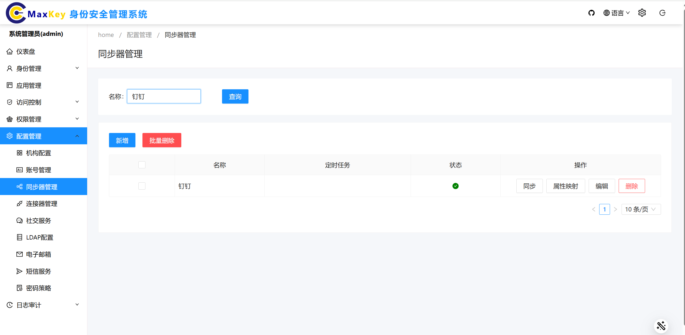
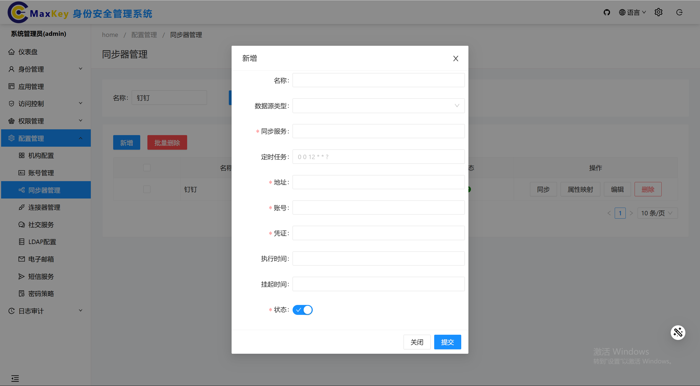
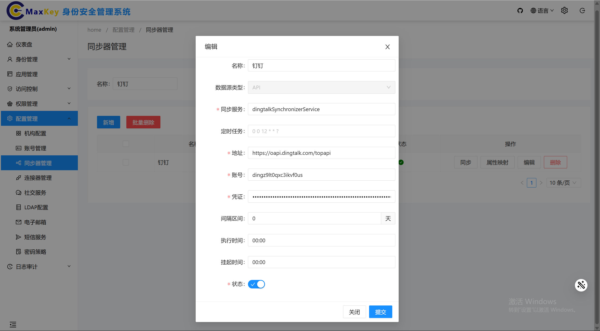
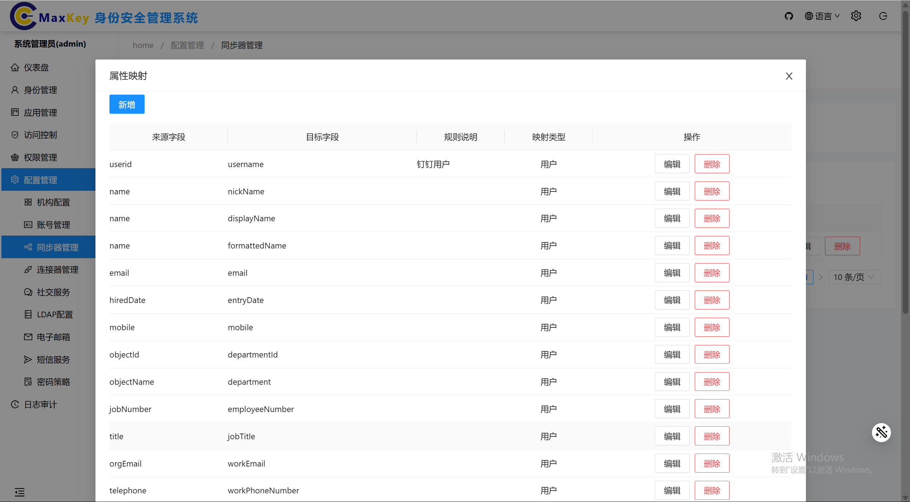
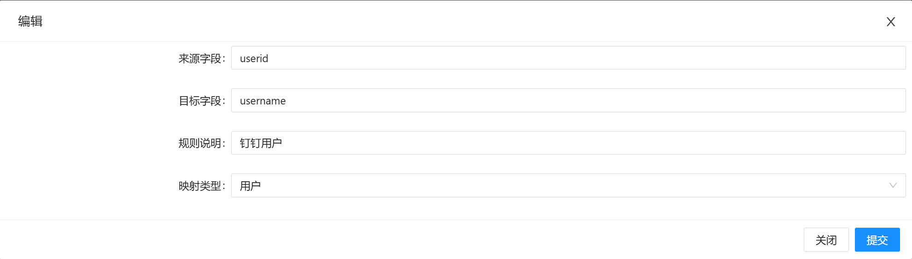
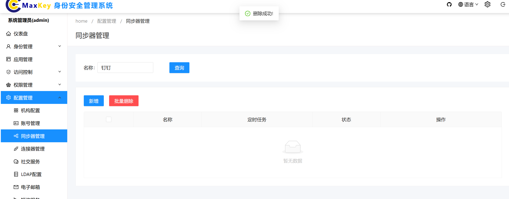

          
# 同步器管理

## 概述
同步器管理模块用于配置和管理不同应用系统之间的数据同步策略，支持查询、新增、编辑、同步和删除操作，确保各应用系统间的数据一致性。

## 访问路径
登录管理控制台 → 配置管理 → 同步器管理

## 界面说明
同步器管理界面主要包含以下元素：
- **查询区**：包含策略名称搜索框和查询按钮
- **策略列表**：展示已配置的同步策略，包含策略名称、应用名称、同步状态、创建时间等信息
- **操作按钮**：包含新增、同步、编辑、删除等功能按钮

## 功能操作

### 查询策略
1. 在查询框中输入策略名称（如"钉钉"）
2. 点击**查询**按钮
3. 系统将显示匹配的策略信息，包括策略名称、关联应用、同步状态等

### 新增策略
1. 点击**新增**按钮，打开新增策略对话框
2. 填写以下信息：

3. 点击**保存**按钮，完成策略创建
4. 系统提示"策略创建成功"，返回策略列表

###  编辑策略
1. 在策略列表中，勾选需要编辑的策略名称
2. 点击**编辑**按钮，打开编辑策略对话框
3. 修改需要更新的信息（如同步周期、同步字段等）
4. 点击**保存**按钮，完成策略更新
5. 系统提示"策略更新成功"，返回策略列表

### 同步策略
1. 在策略列表中，勾选需要同步的策略名称
2. 点击**同步**按钮
3. 系统弹出确认对话框，提示"确定要同步选中的策略吗？"
4. 点击**确定**按钮，系统开始执行同步操作
5. 同步过程中，状态列会显示"同步中"
6. 同步完成后，状态列更新为"同步成功"，并提示"策略同步成功"
### 属性映射
1. 可以进行属性映射，将源应用的字段映射到目标应用的字段。

2. 可以编辑属性映射

### 删除策略
1. 在策略列表中，勾选需要删除的策略名称
2. 点击**删除**按钮
3. 系统弹出确认对话框，提示"确定要删除选中的策略吗？删除后不可恢复！"
4. 点击**确定**按钮，系统执行删除操作
5. 系统提示"策略删除成功"，策略从列表中移除

## 注意事项
1. 同步操作可能会影响关联应用的数据，请谨慎执行
2. 增量同步仅同步上次同步后变更的数据，全量同步会覆盖目标应用的对应数据
3. 删除策略前，请确保该策略不再被其他功能依赖
4. 同步周期设置过短可能会增加系统负担，建议根据实际业务需求合理设置

## 常见问题解答
### Q1: 同步失败怎么办？
A1: 同步失败后，状态列会显示"同步失败"，点击状态可查看失败原因。常见原因包括网络连接问题、目标应用权限不足或数据格式不匹配。解决问题后，可重新执行同步操作。

### Q2: 如何查看同步历史记录？
A2: 点击策略名称右侧的"历史"按钮，可查看该策略的同步历史记录，包括同步时间、同步状态、同步数据量等信息。

### Q3: 可以同时同步多个策略吗？
A3: 可以，在策略列表中勾选多个策略，然后点击**同步**按钮即可同时同步多个策略。
        