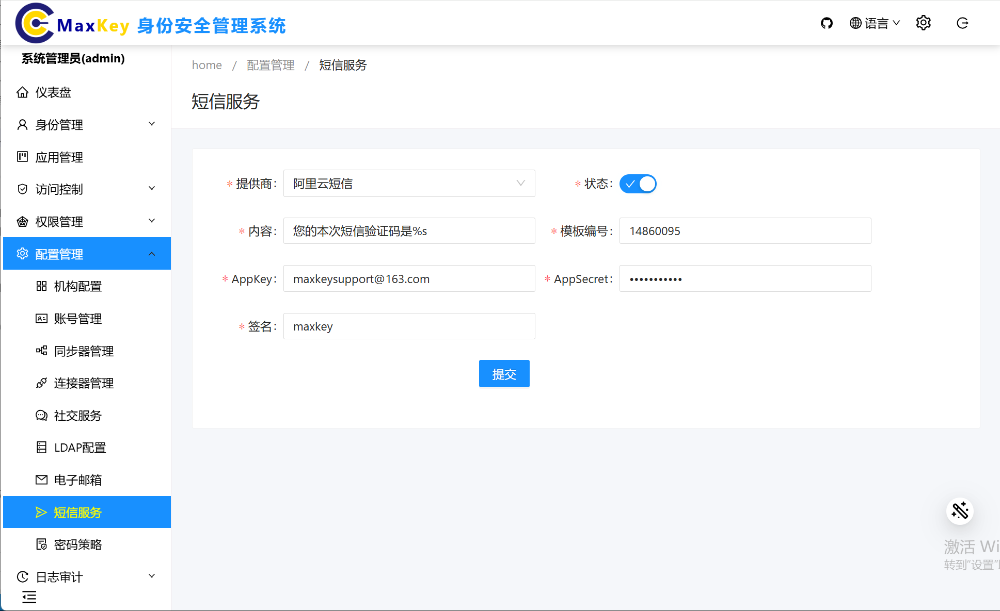

# 短信服务

## 概述
短信服务是一种通过短信消息进行通信的服务，可用于验证用户身份、发送通知等场景。在MaxKey系统中，短信服务配置管理界面提供了对短信服务的相关配置操作。
   
## 配置说明
短信服务配置管理界面提供了对短信服务的相关配置操作，包括：
- 短信服务名称
- 短信服务类型
- 短信服务账号
- 短信服务密码
- 短信服务端口
- 短信服务编码
- 短信服务地址
- 短信服务协议
- 短信服务状态
- 短信服务创建时间
- 短信服务更新时间
- 短信服务备注
