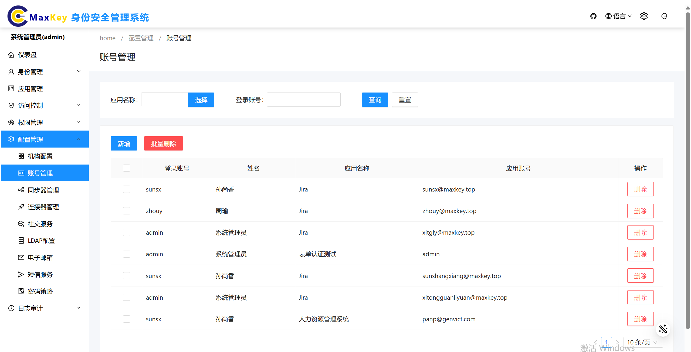
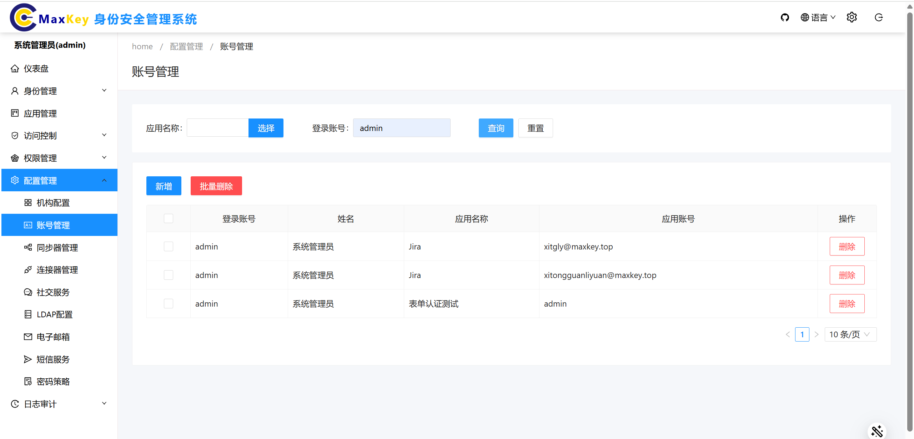
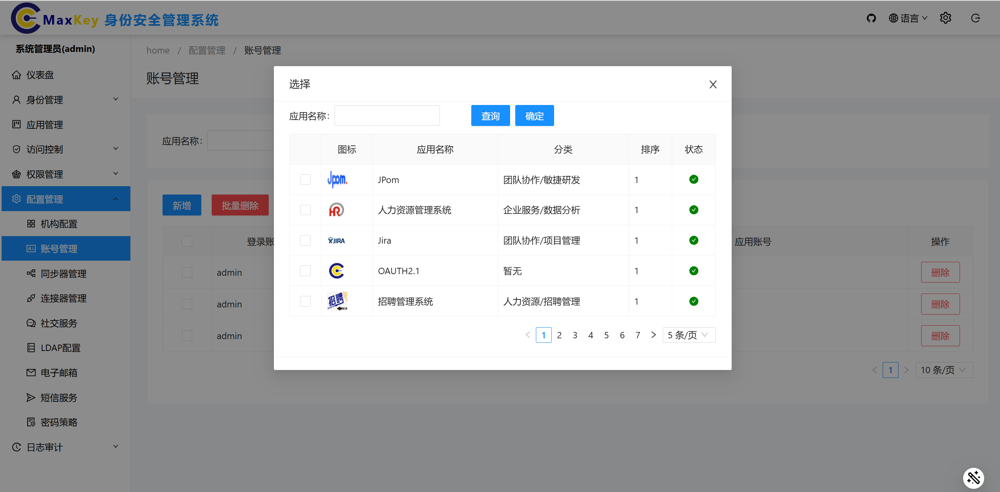
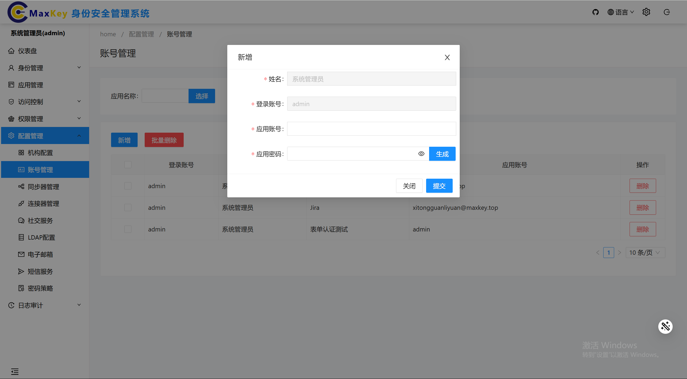
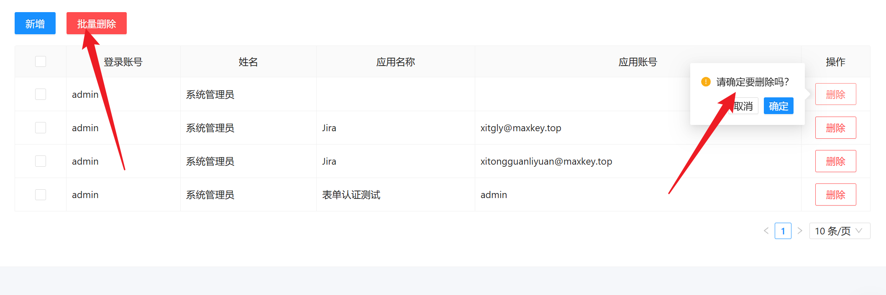

# 账号管理

## 概述
账号管理模块用于管理系统与各类应用之间的账号映射关系，支持账号的查询、新增和删除操作。通过该模块，管理员可以集中管理用户在不同应用系统中的账号信息，实现统一身份认证和授权。

## 访问路径
1. 登录系统管理端
2. 在左侧导航栏中依次点击 **配置管理** → **账号管理**，进入账号管理主界面

## 界面说明
账号管理主界面主要包含以下功能区域：
- **应用选择区**：通过"选择"按钮选择关联的应用系统
- **查询条件区**：包含应用名称输入框和账号查询输入框
- **操作按钮区**：包含"查询"、"新增"等功能按钮
- **账号列表区**：展示查询结果，支持批量选择和操作

## 功能操作

### 查询账号
1. 在账号管理主界面点击 **选择** 按钮，弹出应用系统选择页面
2. 在应用系统选择页面勾选需要查询的应用名称，点击 **确定** 按钮
3. 应用名称会反显到应用名称输入框中
4. 在查询输入框中输入需要查询的账号信息
5. 点击 **查询** 按钮，系统会显示该应用下对应的账号信息
根据用户名查询结果，可进行如下操作：

根据应用名查询结果，可进行如下操作：

### 新增账号
1. 在账号管理主界面点击 **新增** 按钮，跳转弹出账号信息填写界面
2. 填写账号基本信息：
   - **应用名称**：已默认选中，无需修改
   - **登录账号**：点击"请选择"，弹出用户信息选择框
     - 在用户信息选择框中勾选需要关联的用户
     - 点击 **确定** 后，登录账号和用户名将自动反显
   - **策略名称**：点击"请选择"，弹出策略信息选择框
     - 在策略信息选择框中勾选需要应用的策略
     - 点击 **确定** 后，策略名称会自动反显
   - **应用账号**：手动输入应用系统中的账号
   - **应用密码**：点击 **生成** 按钮，系统会自动生成密码

3. 确认所有信息填写完善后，点击 **提交保存** 按钮
4. 系统提示"保存成功"，完成账号添加

### 删除账号
1. 在账号管理主界面，通过查询功能找到需要删除的账号
2. 在账号列表中勾选需要删除的账号（可多选）
3. 点击列表上方的 **删除** 按钮
4. 在确认对话框中点击 **确定** 按钮
5. 系统提示"删除成功"，完成账号删除

> **注意**：删除账号操作不可逆，请确保删除前已确认账号信息不再需要

