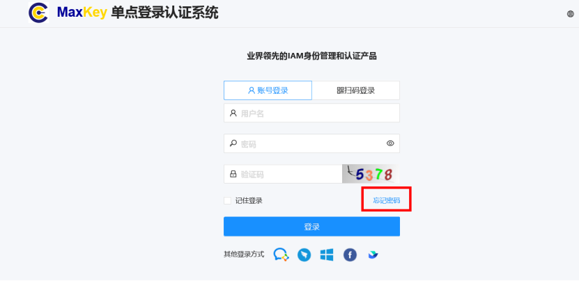
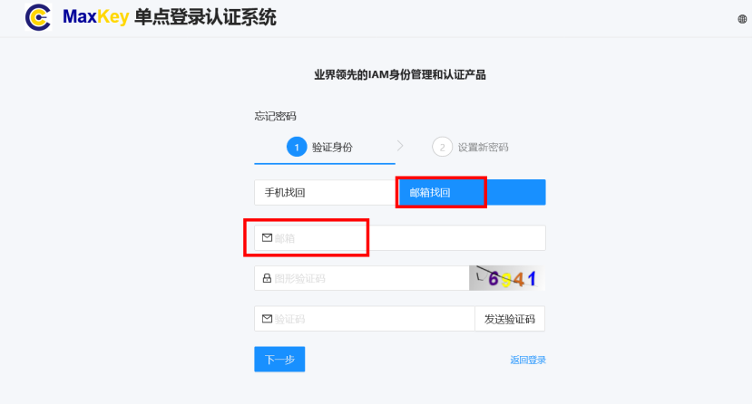
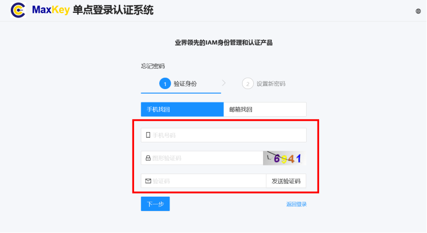

# 忘记密码

当您忘记MaxKey系统登录密码时，可以通过以下几种方式重置密码：

## 自助密码重置

### 通过邮箱重置

1. 在登录页面点击**忘记密码**链接

2. 在密码重置页面选择**邮箱验证**方式
3. 输入您的用户名和注册邮箱
4. 点击**发送验证码**按钮
5. 查收来自系统的密码重置邮件（通常在5分钟内送达）
6. 点击邮件中的重置链接（24小时内有效）
7. 在密码重置页面设置新密码
   - 密码长度至少8位
   - 必须包含大小写字母、数字和特殊符号
   - 不能使用最近5次使用过的密码
8. 确认新密码并提交
9. 使用新密码登录系统

### 通过手机短信重置

1. 在登录页面点击**忘记密码**链接
2. 选择**手机找回**方式
3. 输入注册手机号
4. 点击**获取验证码**按钮
5. 输入收到的短信验证码
6. 验证通过后设置新密码
7. 确认新密码并完成重置

> **注意**：手机短信验证码有效期为10分钟，每个手机号每天最多获取5次验证码

## 密码重置常见问题

### 未收到重置邮件怎么办？
1. 检查垃圾邮件/促销邮件文件夹
2. 确认使用的邮箱是注册时填写的邮箱
3. 联系管理员核实邮箱是否正确
4. 尝试使用其他重置方式（如手机短信）

### 重置链接无效或已过期？
1. 链接有效期为24小时，请重新申请密码重置
2. 确保您使用的是最新收到的重置邮件
3. 检查是否在多个设备上同时打开了重置链接

### 新密码设置提示不符合要求？
MaxKey密码策略要求：
- 长度至少8位，最长64位
- 必须包含大写字母、小写字母、数字和特殊符号
- 不能包含用户名或邮箱信息
- 不能使用连续字符（如123456）或重复字符（如aaaaaa）

### 重置后仍然无法登录？
1. 确认您输入的是新设置的密码
2. 检查Caps Lock键是否开启
3. 清除浏览器缓存后重试
4. 确认账号未被锁定（连续失败5次登录会触发锁定）

