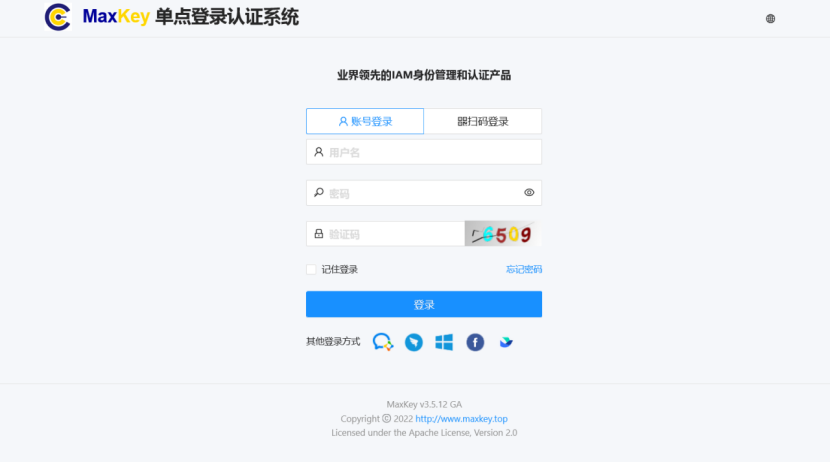
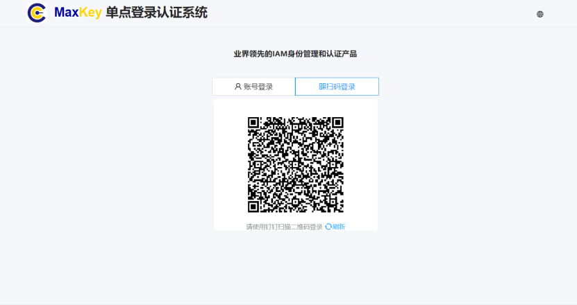
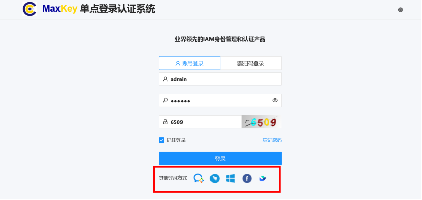
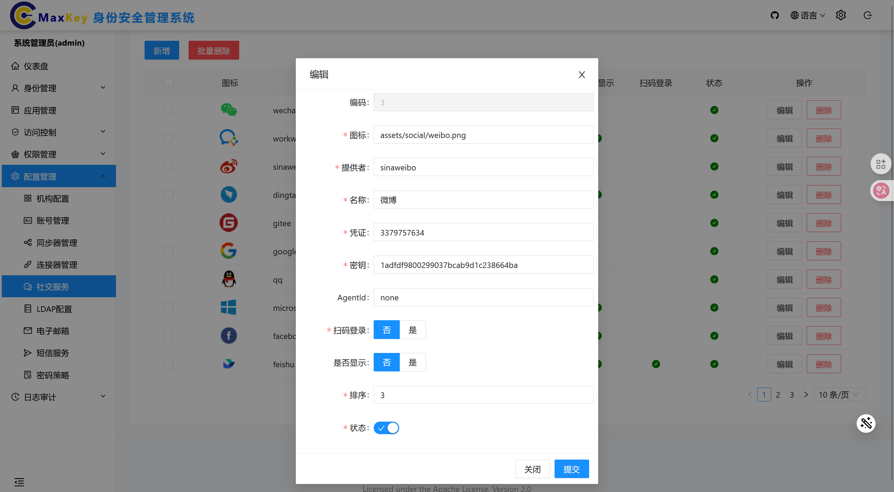
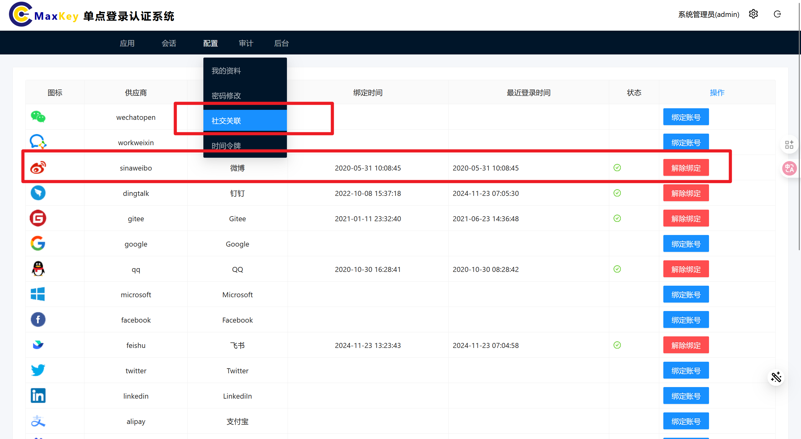
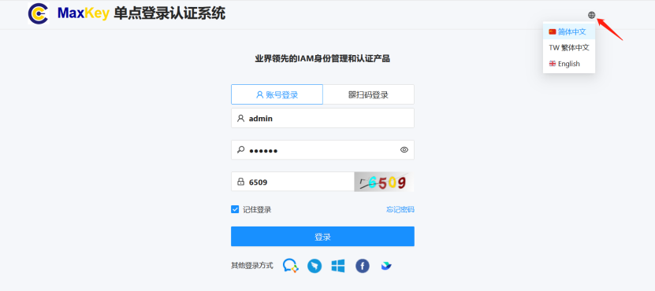
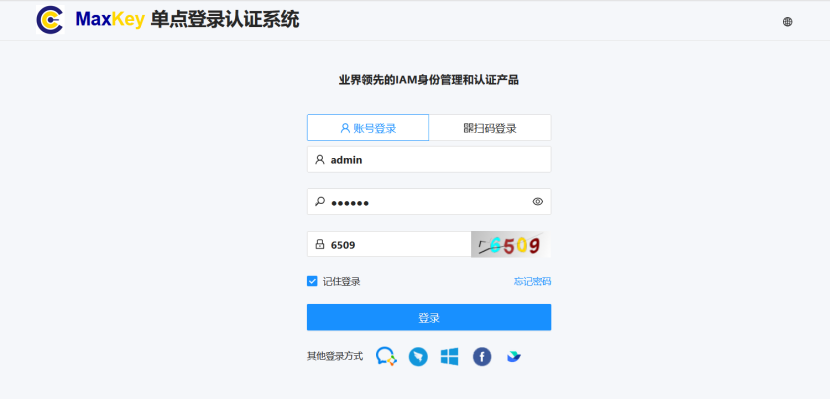
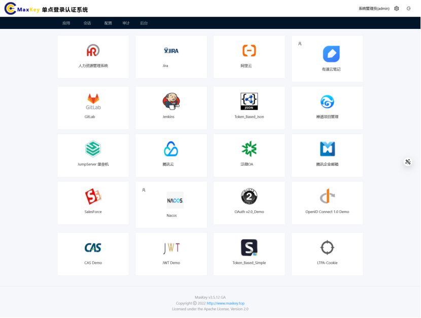

# 用户登录

本文档介绍如何使用MaxKey系统的各种登录方式及常见问题处理。

## 登录入口
（前提：已安装并启动MaxKey系统）
1. 通过浏览器访问系统登录页面：`https://your-maxkey-domain/login`
2. 或通过企业门户点击"单点登录"按钮进入

## 登录方式

### 账号密码登录

1. 在登录页面输入**用户名**、**密码**、**验证码**
2. （可选）勾选"记住我"可保持30天内免登录
3. 点击**登录**按钮

> **安全提示**：公共设备请不要勾选"记住我"

### 扫码登录

1. 点击登录页面的**扫码登录**选项卡
2. 打开企业移动应用扫描页面二维码
3. 在手机端确认登录

### 其他方式登录
为了方便用户的登录，可以通过第三方的账号(例如新浪微博、微信、钉钉等)登录MaxKey，简单配置即可实现用户登录。

1. 点击登录页面底部的社交账号图标（企业微信/钉钉/Microsoft/Facebook/飞书）
2. 在跳转页面完成账号授权
3. 授权成功后自动登录系统

本文以新浪微博为例

<h3>登录流程</h3>

## 第三方认证配置
在新浪微博开放平台https://open.weibo.com/申请接入，新浪配置如下

## 认证配置
文件启用第三方登录启用
maxkey/application-https(http).properties

<pre><code class="ini hljs">
#enable social sign on
maxkey.login.socialsignon=true
</code></pre>

## 后台参数配置

后台管理 -> "配置管理" ->"社交服务" 

选中 "微博" -> "编辑" ，微博的app key和app secret填入凭证和密钥

## 账号绑定
登录MaxKey，并绑定新浪微博账号

## 登录测试

退出后，进入登录界面，点击新浪微博图标，跳转到新浪微博，输入用户名和密码后，直接登录MaxKey,即MaxKey信任了微博账号，
## 第三方支持

MaxKey使用JustAuth作为第三方OAuth2登录认证库，认证所支持的第三方，请见JustAuth官方说明

## 登录设置

### 语言切换
点击登录页面右上角语言选择器，可切换：
- 简体中文
- 繁体中文
- English

### 记住登录状态
- 勾选"记住我"后，系统会在本地保存登录状态30天
- 公共电脑建议不要使用此功能
- 可在个人中心随时清除登录状态

## 登录完成
登录成功后，系统会自动跳转到首页页面。

## 常见问题

### 忘记密码
1. 在登录页面点击**忘记密码**链接   
2. 输入手机号/邮箱
3. 选择验证方式（手机号/邮箱）
4. 接收验证码并设置新密码 
详见[忘记密码](../authentication/忘记密码.md)
### 账号被锁定
- 连续登录失败6次将锁定30分钟.
- 可等待自动解锁或联系管理员手动解锁

### 登录后自动退出
可能原因及解决方法：
1. 会话超时：活动时间超过30分钟，请重新登录
2. 账号在其他设备登录：系统默认允许3个并发会话
3. 网络异常：检查网络连接稳定性

### 无法接收验证码
1. 检查手机号/邮箱是否正确且已验证
2. 检查垃圾邮件/短信文件夹
3. 60秒后可重新获取验证码
4. 联系管理员检查消息服务状态

## 安全提示

- 请勿向他人泄露账号密码
- 定期更换密码（建议每90天）
- 登录异常时及时修改密码并联系管理员
- 退出登录时使用页面**安全退出**按钮