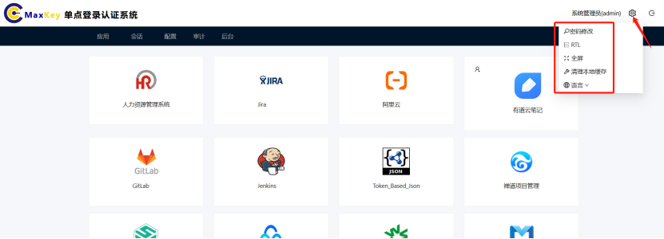
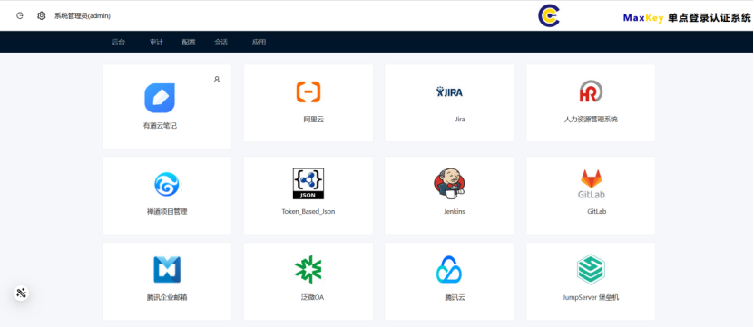
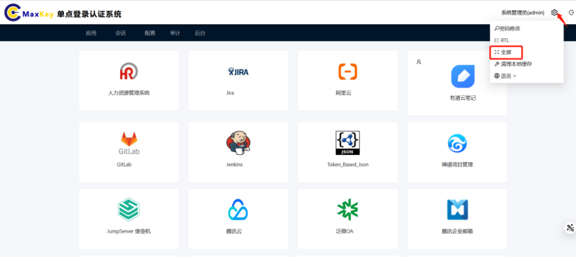

# 页面配置指南

系统右上角的齿轮图标提供了多种页面相关的配置功能，点击后将显示配置菜单。

## 配置菜单功能说明

### 密码修改
1. 在配置菜单中点击**密码修改**选项
2. 输入当前密码
3. 设置并确认新密码（需符合密码复杂度要求）
4. 点击**保存**完成修改

> **注意**：密码修改后需重新登录系统

### RTL布局切换
RTL（Right-to-Left）布局功能可将界面切换为从右到左的显示模式，适用于阿拉伯语、希伯来语等语言环境：

1. 在配置菜单中点击**RTL**选项
2. 系统界面将立即切换为从右到左布局
3. 再次点击可恢复默认的从左到右布局

#### 切换效果对比

| 从左到右布局（默认） | 从右到左布局（RTL） |
|---------------------|---------------------|
| 菜单在左侧，内容在右侧 | 菜单在右侧，内容在左侧 |
| 文字从左到右排列 | 文字从右到左排列 |
| 按钮在右侧 | 按钮在左侧 |

### 全屏模式
1. 在配置菜单中点击**全屏**选项
2. 系统将切换至全屏显示模式
3. 退出全屏可按键盘**ESC**键，或再次点击配置菜单中的**退出全屏**选项
> **提示**：部分浏览器可能需要授权全屏显示权限

### 清理本地缓存
清理本地缓存将删除浏览器中存储的临时数据，包括：
- 登录状态信息
- 表单自动填充数据
- 页面缓存资源

操作步骤：
1. 在配置菜单中点击**清理本地缓存**选项
2. 在确认对话框中点击**确定**
3. 系统清理完成后将自动刷新页面

> **注意**：清理缓存后需重新登录系统

### 语言设置
1. 在配置菜单中点击**语言**选项
2. 从下拉列表中选择所需语言
3. 页面将立即切换为所选语言

#### 支持的语言
- 简体中文
- 繁体中文
- English

## 常见问题

### Q: RTL切换后部分界面显示异常怎么办？
A: 可尝试刷新页面（F5）或切换回默认布局后重新切换

### Q: 清理缓存后无法登录怎么办？
A: 请确认使用正确的账号密码，或通过"忘记密码"功能重置密码

### Q: 全屏模式下看不到配置菜单怎么办？
A: 将鼠标移动到屏幕顶部，菜单栏会自动显示