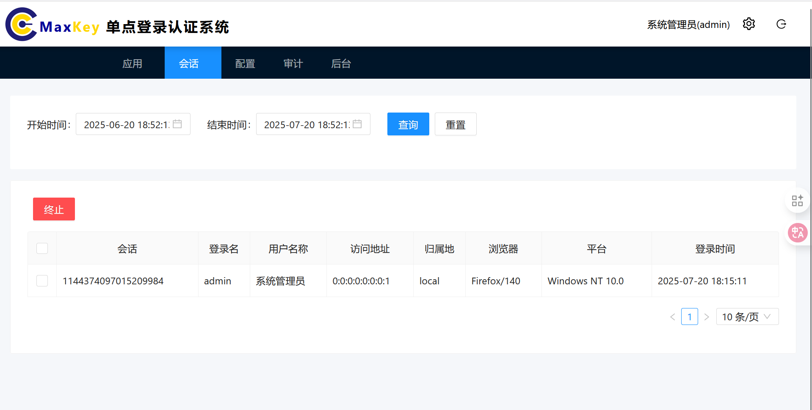

# 会话

## 功能概述
会话管理模块允许用户查看和管理当前活跃的登录会话，包括查询会话信息和终止特定会话。通过此功能，用户可以监控账户的登录状态，及时发现异常访问并采取安全措施。

## 访问路径
登录MaxKey系统后，点击顶部导航栏的**会话**

## 界面说明
会话管理界面主要包含以下元素：
- **查询区域**：提供多种筛选条件
- **会话列表**：展示符合条件的会话信息
- **操作按钮**：对选中的会话执行终止操作

## 会话查询
### 基本查询
用户可以直接查看当前所有活跃会话，列表默认显示以下信息：
- **会话ID**：系统分配的唯一会话标识
- **登录名**：用户登录账号
- **用户名称**：用户姓名全称
- **访问地址**：登录IP地址
- **归属地**：IP地址对应的地理位置
- **浏览器**：登录使用的浏览器及版本
- **平台**：登录设备的操作系统
- **登录时间**：会话创建的时间
- **会话状态**：当前会话状态（活跃/即将过期/已过期）
- **最后活动时间**：会话最近一次交互的时间

#### 会话列表示例

| 会话ID | 登录名 | 用户名称 | 访问地址 | 归属地 | 浏览器 | 平台 | 登录时间 | 会话状态 | 最后活动时间 |
|--------|--------|----------|----------|--------|--------|------|----------|----------|--------------|
| 1144374097015209984 | admin | 系统管理员 | 0:0:0:0:0:0:0:1 | local | Firefox/140 | Windows NT 10.0 | 2025-07-20 18:15:11 | 活跃 | 2025-07-20 18:30:25 |

## 终止会话
### 单个会话终止
1. 在会话列表中，找到需要终止的会话
2. 点击对应行操作列的**终止**按钮
3. 在确认弹窗中点击**确定**完成操作

### 批量终止会话
1. 勾选多个需要终止的会话前的复选框
2. 点击列表上方的**批量终止**按钮
3. 在确认弹窗中点击**确定**完成操作

> **注意**：终止当前正在使用的会话将导致立即退出登录，请谨慎操作。

## 常见问题
### Q: 为什么有些会话显示异常登录地点？
A: 这可能是由于IP地址定位不准确导致的，建议重点关注登录时间和设备信息是否异常。

### Q: 终止会话后，被终止的设备还能访问系统吗？
A: 不能，终止会话后，对应的设备将失去访问权限，需要重新登录。

### Q: 会话列表中没有显示我当前的登录会话？
A: 请尝试点击**刷新**按钮更新会话列表，或检查筛选条件是否过滤了当前会话。

### Q: 最多可以同时查看多少条会话记录？
A: 系统默认显示最近100条会话记录，如需查看更早的记录，请使用时间范围筛选。

### Q: 会话ID有什么作用？
A: 会话ID是系统识别会话的唯一标识，联系管理员排查登录问题时，提供会话ID可以快速定位问题。