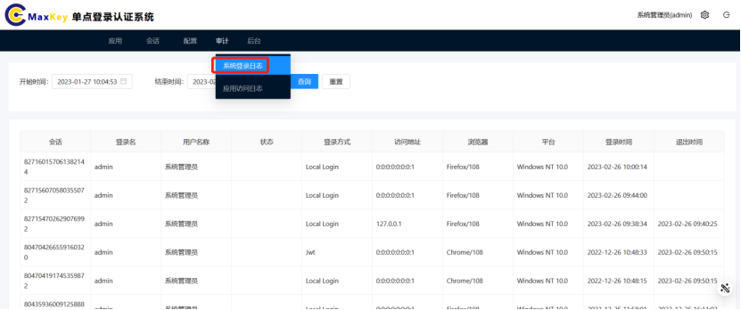

# 审计

审计模块提供系统操作记录的查询功能，帮助用户追踪账号活动和系统访问情况。

## 系统登录日志

系统登录日志记录所有用户的登录活动，提供全面的安全审计依据。

### 访问入口
点击顶部导航栏的**审计** → **系统登录日志**

### 日志信息说明
登录日志表格展示以下信息：

| 字段名称 | 说明 | 示例 |
|---------|------|------|
| 会话ID | 系统生成的唯一会话标识 | SID-20230915-123456 |
| 登录名 | 用户登录账号 | user001 |
| 用户名称 | 用户真实姓名 | 张三 |
| 登录状态 | 成功/失败 | 成功 |
| 登录方式 | 账号密码/扫码/短信/社交账号等 | 账号密码 |
| 访问地址 | 用户IP地址 | 192.168.1.100 |
| 归属地 | 访问IP地址对应的位置 | local |
| 浏览器 | 用户使用的浏览器及版本 | Chrome 116.0.5845.180 |
| 平台 | 操作系统及设备类型 | Windows 10 / PC |
| 登录时间 | 登录成功的时间 | 2023-09-15 08:30:25 |
| 退出时间 | 主动退出或超时退出时间 | 2023-09-15 12:05:10 |

### 日志筛选

 **时间范围筛选**：
   - 点击页面顶部的**开始时间**和**结束时间**选择框
   - 选择需要查询的时间范围（支持精确到分钟）
   - 点击**查询**按钮应用筛选

## 访问日志

应用访问日志记录用户通过单点登录访问各应用系统的详细信息。

### 访问入口
点击顶部导航栏的**审计** → **应用访问日志**

### 日志信息说明
访问日志表格展示以下信息：

| 字段名称 | 说明 | 示例 |
|---------|------|------|
| 会话ID | 与登录日志关联的会话标识 | SID-20230915-123456 |
| 登录名 | 用户登录账号 | user001 |
| 用户名称 | 用户真实姓名 | 张三 |
| 应用名称 | 应用系统名称 | 企业资源计划系统 |
| 登录时间 | 访问应用的时间 | 2023-09-15 09:15:30 |

### 日志筛选

1. **基础筛选**：
   - 开始时间/结束时间：选择查询的时间范围
   - 应用名称：下拉选择特定应用（默认全部）

## 常见问题

### Q: 为什么某些日志记录没有退出时间？
A: 可能原因包括：用户直接关闭浏览器、网络异常断开连接、系统崩溃等。系统会在会话超时后自动标记为"超时退出"

### Q: 导出日志时提示权限不足怎么办？
A: 日志导出功能需要"审计日志导出"权限，请联系管理员为您的账号分配相应权限