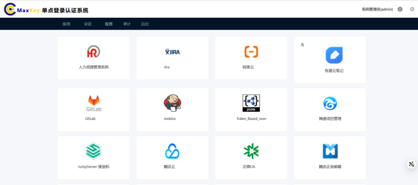

# 应用访问中心

## 功能概述
应用访问中心是用户获取和访问所有已授权应用系统的统一入口。通过单点登录(SSO)技术，用户只需一次身份验证，即可无缝访问多个授权应用，无需重复登录，提升工作效率与用户体验。

## 访问路径
1. 成功登录MaxKey系统后，系统默认展示应用访问中心界面
2. 或点击顶部导航栏的**应用**图标进入

## 界面说明
应用访问中心主要包含以下功能区域：

### 1. 页面导航区
- **搜索框**：支持按应用名称**所在标签**搜索
- **分类标签**：按应用类型进行分类筛选（如企业服务、团队协作、人力资源、考试培训、财务管理、表单流程、供应链、客户关系等）
- **刷新按钮**：手动刷新应用列表

### 2. 应用展示区
- **应用卡片**：显示应用图标、名称及简要描述

## 应用访问操作

### 1. 基本访问流程
1. 在应用展示区找到目标应用
2. 点击应用图标或名称
3. 系统将自动完成单点登录并跳转至应用系统

### 2. 搜索与筛选
- **快速搜索**：在顶部搜索框输入应用名称关键词标签，系统实时筛选结果
- **分类筛选**：点击分类标签，只显示该分类下的应用

## 常见问题

### Q: 点击应用图标后没有反应怎么办？
A: 请尝试以下解决方案：
1. 检查浏览器地址栏是否有弹出窗口阻止提示，允许弹出窗口
2. 清除浏览器缓存后重试
3. 确认应用状态是否为"正常"
4. 联系管理员检查应用配置和用户权限

### Q: 为什么有些我有权限的应用没有显示在列表中？
A: 可能原因及解决方法：
1. 应用可能被归类到其他分类标签下，尝试切换分类查看
2. 使用搜索功能直接搜索应用名称
3. 新授权的应用可能需要刷新页面才能显示
4. 联系管理员确认应用是否已发布到用户可见范围

