# 配置

## 3.7.1 我的资料

点击顶部导航栏的**配置**，进入**我的资料**界面。系统采用多标签页形式展示不同类别的个人信息，用户可根据需要查看或修改对应内容。
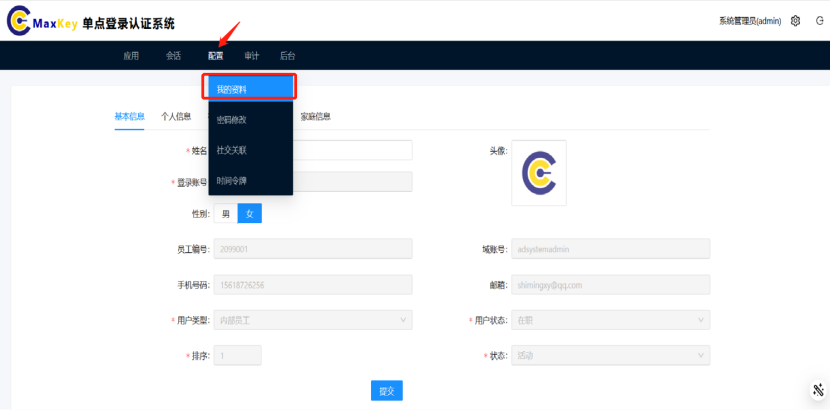
### 基本信息标签页
展示用户核心身份信息，包括：
- 用户ID（系统生成，不可修改）
- 用户名（登录账号，不可修改）
- 姓名（可修改）
- 邮箱（可修改，需验证）
- 手机号码（可修改，需验证）
- 头像（支持上传/拍摄更换）
- 性别（男/女/保密）
- 出生日期（日期选择器）
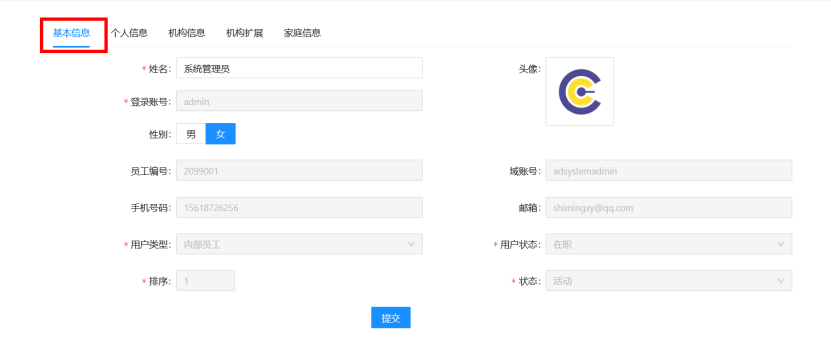

### 个人信息标签页
补充个人详细信息：
- 学历（下拉选择：小学/初中/高中/专科/本科/硕士/博士）
- 专业（文本输入）
- 毕业院校（文本输入）
- 入职日期（系统自动记录，不可修改）
- 岗位名称（文本输入）
- 工号（系统生成，不可修改）
- 联系地址（文本输入）
- 紧急联系人（姓名+电话）
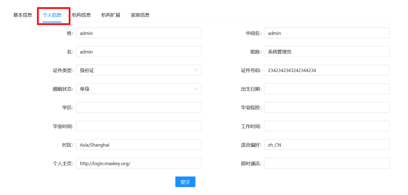
### 机构信息标签页
显示用户所属组织架构信息：
- 所属单位（下拉选择，仅管理员可修改）
- 部门（下拉选择，仅管理员可修改）
- 科室/团队（文本输入）
- 职级（下拉选择：普通员工/主管/经理/总监/高管）
- 角色（系统分配，不可修改）
- 权限范围（只读展示）
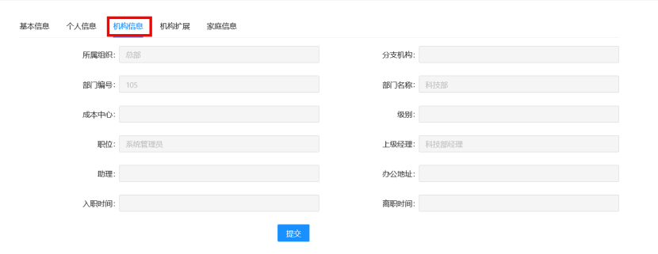
### 机构扩展标签页
扩展机构相关信息：
- 员工类型（正式/实习/外包/顾问）
- 政治面貌（群众/共青团员/中共党员/其他）
- 婚姻状况（未婚/已婚/离异/丧偶）
- 健康状况（良好/一般/较差）
- 合同期限（开始日期-结束日期）
- 社保公积金所在地（省市选择）
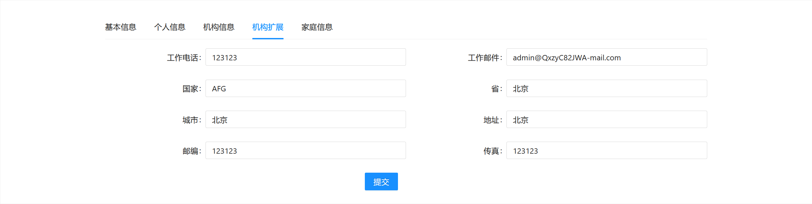

### 家庭信息标签页
记录家庭成员信息：
- 配偶信息（姓名、关系、工作单位、联系电话）
- 子女信息（姓名、性别、出生日期、学校/工作单位）
- 父母信息（姓名、年龄、工作单位/退休状态、联系电话）
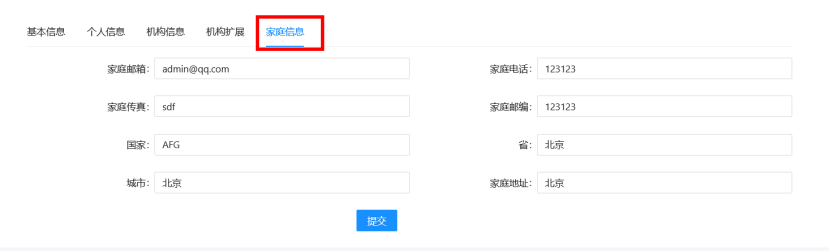
> **注意**：所有修改需点击各标签页底部的**保存**按钮生效，带*号的为必填项

## 3.7.2 密码修改

系统提供两种密码修改入口，用户可根据习惯选择：

### 入口一：通过配置菜单
1. 点击顶部导航栏的**配置**
2. 在下拉菜单中选择**密码修改**

### 入口二：通过右上角快捷菜单
1. 点击页面右上角的**齿轮图标**
2. 在弹出菜单中选择**密码修改**
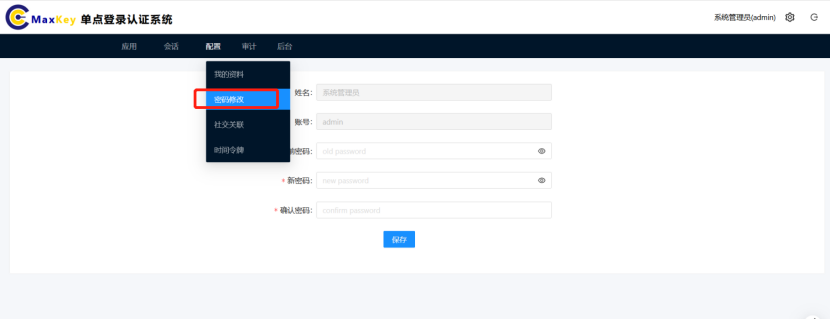
### 修改步骤
1. 在密码修改界面，输入**当前密码**
2. 设置**新密码**，需满足以下要求：
   - 长度8-64位
   - 包含大小写字母、数字和特殊符号
   - 不能与最近5次使用过的密码相同
3. 再次输入**确认新密码**
4. （可选）点击**自动生成**获取系统推荐的强密码
5. 点击**保存**完成修改

> **安全提示**：密码修改成功后，所有已登录设备将被强制登出，需使用新密码重新登录

## 3.7.3 社交关联

通过社交关联功能，用户可将当前账号与第三方社交账号绑定，实现社交账号快捷登录。

### 操作入口
点击顶部导航栏的**配置** → **社交关联**

### 支持的社交平台
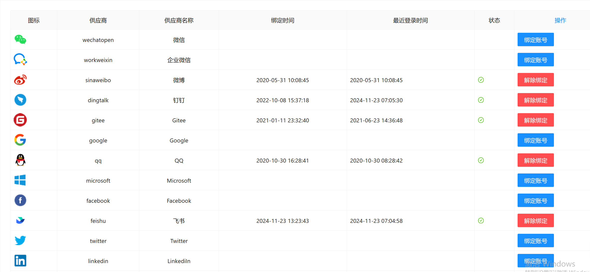
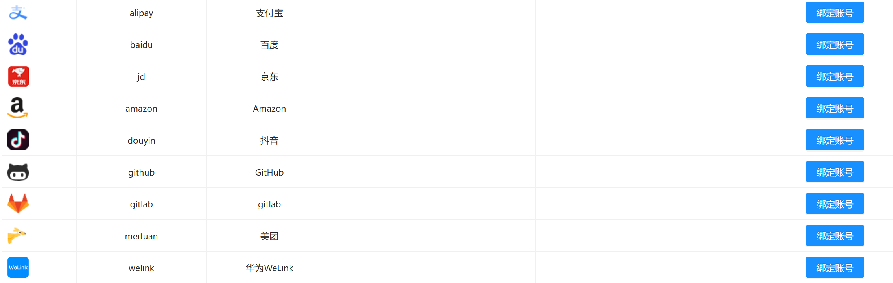

### 绑定账号流程
1. 在社交关联页面，找到需要绑定的平台图标
2. 点击**绑定账号**按钮
3. 在跳转的第三方授权页面完成登录授权
4. 授权成功后自动返回系统，显示"绑定成功"
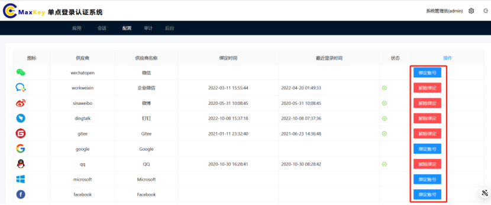

### 解除绑定流程
1. 在社交关联页面，找到已绑定的平台
2. 点击**解除绑定**按钮
3. 在确认对话框中输入**当前密码**进行身份验证
4. 点击**确认**完成解除绑定

> **提示**：至少保留一种可用的登录方式，避免所有登录方式均被解除绑定

## 3.7.4 时间令牌

时间令牌是一种基于TOTP/HOTP算法的双因素认证方式，提高账号登录安全性。

### 操作入口
点击顶部导航栏的**配置** → **时间令牌**
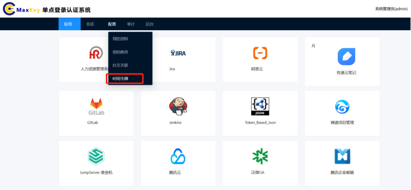
### 生成与绑定步骤
1. 在时间令牌页面，点击**生成**按钮
2. 系统显示令牌参数配置：
   - 算法：SHA1（默认）
   - 位数：6位（默认）
   - 周期：30秒（默认）
   - 类型：TOTP（默认）
3. 点击**生成**后生成二维码和密钥
4. 使用认证软件扫描二维码（支持Google Authenticator、Microsoft Authenticator、FreeOTP等）
5. 在手机认证软件中确认添加
6. 在系统页面输入手机上显示的6位数字令牌
7. 点击**验证**完成绑定

### 使用方法
1. 在登录页面输入账号密码后，选择**安全认证** → **时间令牌**
2. 打开手机认证软件，获取当前6位数字令牌
3. 输入令牌后完成登录
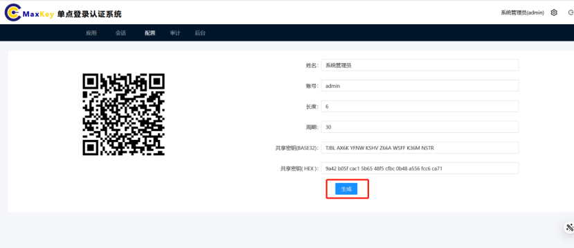
### 注意事项
- 令牌每30秒更新一次，过期后需使用新令牌
- 建议同时保存备用密钥，以便手机丢失时恢复
- 可点击**重新生成**更换令牌（原令牌将失效）

> **安全建议**：启用时间令牌后，即使账号密码泄露，他人仍无法登录您的账号